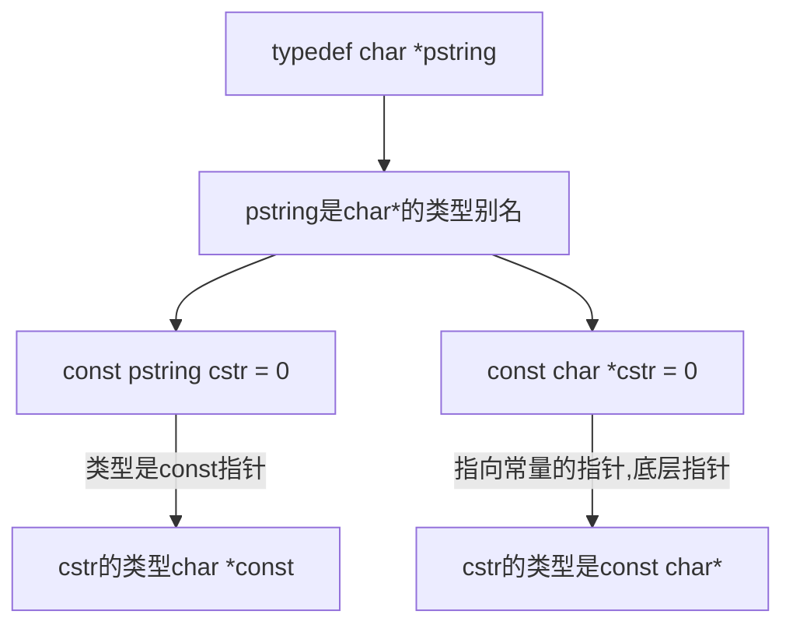
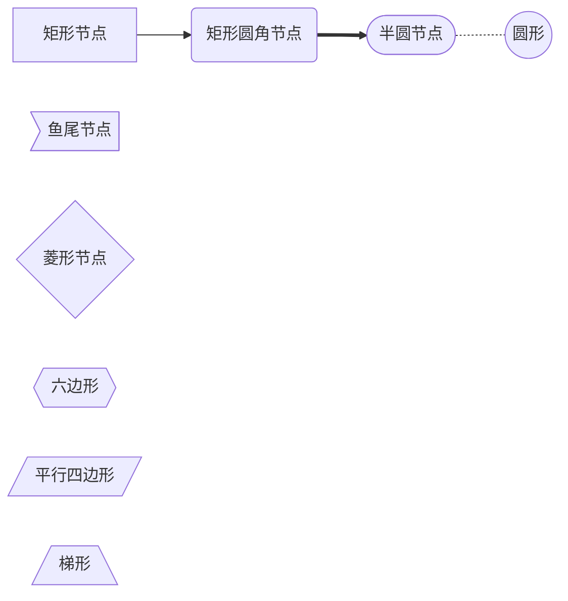
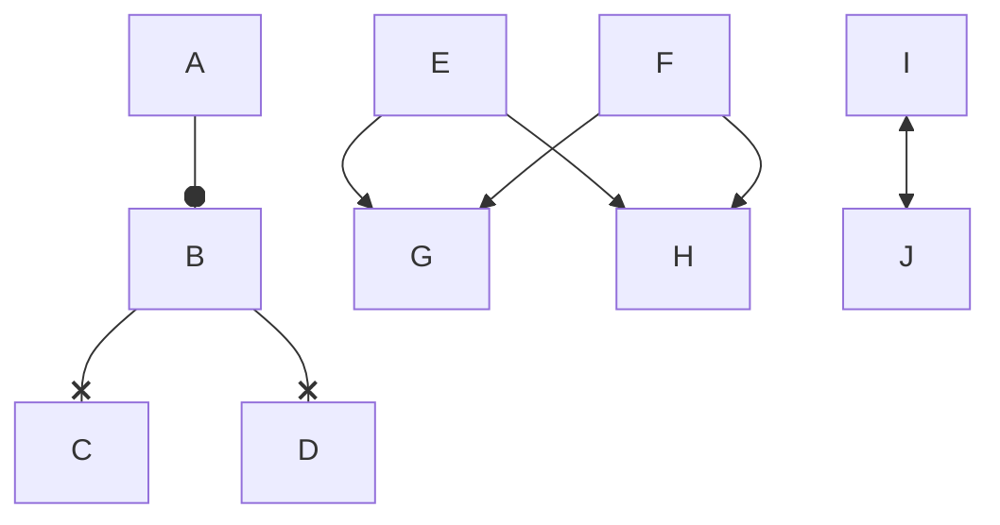

# 一级标题

## 二级标题

***

## 字体

**加粗Hello World**  
***斜体加粗Hello world***  
<u>下划线Hello World</u> 
~~划线Hello World~~  
***

## 引用

> Hello World;
>> Hello china;

## 分割线

---

***

## 图片

  
***

## 超链接

直接链接<https://www.runoob.com/markdown/md-tutorial.html>  
[MarkDown菜鸟教程](https://www.runoob.com/markdown/md-tutorial.html)  
***

## 列表

### 有序列表 

1. A[^脚注]
2. B
3. C

### 无序列表

- A
- B
- C

## 表格

| A | B | C |  
| :----: | ----: | ---- |
| a | b | C |

## 代码

```c++
[[include]] <iostream>
using namespace std;
int main()
{
    cout << "Hello, world!" << endl;
    return 0;
}
```
## 脚注

MarkDown[^脚注]
[^脚注]:脚注内容

## 预留字符串

| 字符串 | 实体 |
| -- | -- |
| ```&ensp;``` | 一个空格 |
| ```&nbsp;``` | 一个空格 |
| ```&emsp;``` | 两个空格 |
| ```&lt;``` | 小于号 |
| ```&gt;``` | 大于号 |

## MarkDown箭头

箭头样式:
| 箭头形状 | MarkDown |
| :--: | :--: |
| $\longleftarrow$ | ```$\longleftarrow$```|
| $\Longrightarrow$ | ```$\longleftarrow&```|

## 页内跳转

[跳转链接]([[jumpid]])

<span id = "jumpid">跳转位置</span>

[c++]()

## 画图语法

### mermaid

- graph 流程图
  - graph TD
  - graph TB
  - graph LR

> T:Top, B and D: Bottom, L and R: Left and Right

- stateDiagram 状态图







### sequence

```sequence
left -> right : left ot right
Note right of right:right context
Note left of left:left content
```

### LaTex语法

- `$`数学环境命令符
- `%`注释符
- `^`数学环境下的上标
- `&`数学环境下跳列符
- `_`数学环境下的下标命令符
- `\`LaTex命令
- `{args}`LaTex命令参数

\documentclass

$$
z = \overbrace{
   \underbrace{x}_\text{real} + i
   \underbrace{y}_\text{imaginary}
  }^\text{complex number}\tag{1}
$$

- 对齐

$$
\begin{aligned}
B'&=-\partial \times E,\\         %加&指定对齐位置
E'&=\partial \times B - 4\pi j,
\end{aligned}
$$

- 大括号

$$ 
f(x)=\left\{          % 表示大括号
\begin{aligned}
x & = & \cos(t) \\
y & = & \sin(t) \\
z & = & \frac xy
\end{aligned}
\right.
$$

- 

$$
\begin{aligned}
 \left.\begin{aligned}
        B'&=-\partial \times E,\\         %加&指定对齐位置
        E'&=\partial \times B - 4\pi j,
       \end{aligned}
 \right\}
 \qquad \text{Maxwell's equations}
\end{aligned}
$$