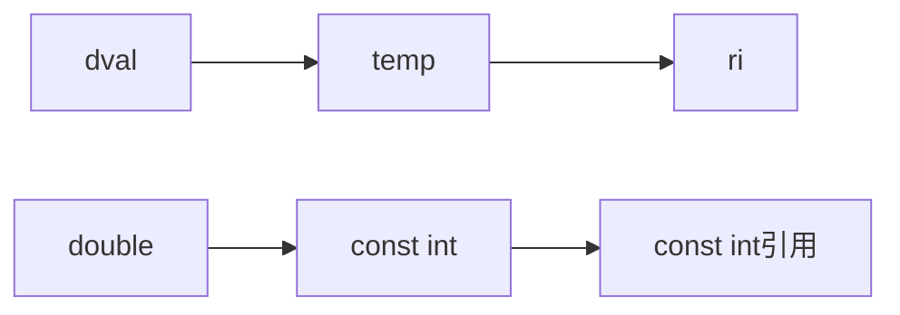

# c++基础

[[基本类型]]

### 2. 处理类型

#### <span id= "typedef">2.1 typedef关键字,定义类型别名</span>

  ```c++
  typedef double wages;
  typedef wages base,*p;  // base是double的别名,p是double*的别名
  ```

- 复合类型或常量的类型别名

  ```mermaid
  graph TB
  A0[typedef char *pstring]-->A
  A[pstring是char*的类型别名]-->B[const pstring cstr = 0]; 
  A-->C[const char *cstr = 0];
  B--类型是const指针-->D[cstr的类型char *const];
  C--指向常量的指针,底层指针-->E[cstr的类型是const char*]
  ```

  [参考指针和const](#ptrconst)

  ```c++
  typedef char *pstring;  // pstring是char*的别名
  const pstring cstr = 0;  // cstr是指向char的const指针 
  const pstring *ps;  // ps是一个指针，他的对象是指向char的常量指针
  ```

- `typedef int arrT[10];`arrT是一个包含10个整型的数组

```c++
typedef int arrT[10];
using = arrT = int[10];
arrT* func(int i);  // 对func的返回值解引用得到包含10个整型的数组，因此func的返回类型是数组指针
```

- c语言中typedef可以用来定义结构体

```c
typedef struct
{
    int a;
    double b;
} structname;
```


#### 2.2 using别名声明

- `using wages = double;`表示wages是double的别名

#### 2.3 auto说明符，让编译器去分析表达式的类型

- auto会忽略掉顶层const,底层const会保留下来
- 顶层const需明确指出`const auto f = ci;`
- 若表达式是引用对象，auto以引用对象的类型作为auto的类型

```c++
int i = 0;
int &r = i;
const int ci = i;
const int &cr = ci;
auto a = r;  // r is alias of i,type is int; a is int
auto b = ci;  // b type is int
auto c = cr;  // c type is const int
auto d = &i;  // d type is int*
auto e = &ci  // e type is const int*
```

#### <span id= "decltype">2.4 decltype类型推导符</span>

- 为泛型编程设计，主要解决有些类型有模板参数决定而难以表示的问题
- decltype分析**变量**类型,**表达式**计算类型,**函数**返回的数据类型，声明或定义变量类型为**相应**数据类型

```c++
decltype(func()) x = a; 
// decltype的作用是分析func函数的返回值类型，将x声明或定义为此类型
```

- decltype不会忽略顶层const和引用操作

```c++
cosnt int ci = 0, &cj = ci, *cp = ci;
decltype(ci) x = 0;  // x的类型是const int, 是顶层const
decltype(cj) y = x;  // y的类型是const int&, 底层const, 指向const的引用
```

- 对于解引用操作，**decltype**仍将得到引用类型

```c++
int i = 42, *p = &i, &r = i
decltype(r + 0) a;  // r + 0 是一个表达式, a的类型是int
decltype(r) b;  // r是一个变量，b是引用 
decltype(*p) c;  // c是一个引用
```

- decltype对于变量名**加括号**与**不加括号**得到的类型不同
  - 不加括号：得到该变量类型
  - 加括号：编译器会把它当成一个表达式，变量是可以作为赋值语句左值的特殊表达式,会得到引用类型
  - decltype((*variable*))的结果永远是引用，decltype(*variable*)的结果只有当variable本身是引用时才是引用

  ```c++
  int i = 42;
  decltype((i)) d;  // 错误：d是引用，必须初始化
  decltype(i) d;  // √
  ```

### 3. 变量

- 声明和定义的关系
  - 为了支持分离式编译，c++将声明和定义区分开
  - 声明规定了变量的**类型**和**名字**
  - 定义除了声明的作用外还申请存储空间也可能为变量赋一个初始值
- extern关键字
  - 在**链接的文件**而不是**相同目录中**中搜寻有关键字extern修饰的变量或函数
  - 扩展变量作用域
  - 扩展变量到其他文件
  - 扩展函数到其他文件
  - 将函数扩展到其他文件
  - `extern int x;` 告诉编译器某处存在一个名为x，类型是int的对象

### 4. 左值引用

- 操作符 **&**
- 引用是对象的别名
- 引用必须被初始化
- 引用和初始值绑定在一起，无法令引用绑定到另外一个对象
  
### 5. 指针

- 指针存放某个对象的**地址**
- 指针类型type*
- 属于复合类型
- 指针的值
  - 指向一个对象
  - 指向紧邻对象所占空间的下一个位置
  - 空指针，字面值**nullptr**
  - 无效指针
  > 对于第二种和第三种，其使用受到限制，这些指针没有指向具体对象，试图访问这类指针的行为是不被允许的
- 解引用符*

### 6. & and *

- & 和 * 非基本数据结构
- & 和 * 在表达式左侧是声明符
- & 和 * 在表达式右侧是操作符
  - &取地址
  - *解引用

### 7. 左值和右值

- 赋值语句左侧的一定是左值，右侧可以是左值也可是右值
- 以下运算符的求值结果<font color="red">左值</font>
  - 内置解引用运算符
  - 下标运算符
  - 迭代器解引用运算符
  - string和vector的下标运算符
  - 前置递增/递减
- <font color="red">右值</font>
  - 返回**非引用类型**的函数
  - 算数，关系，位运算符
  - 后置递增/递减

### 8. 自定义数据结构

#### 类数据成员初始化

可以为数据成员提供一个类内初始值，没有初始值的成员将被默认初始化;
double类，int类初始化为0,string类初始化为空字符串

|type|初始化值|
| -- | :--: |
|int,double|0|
|string|空字符串|

### 9. const限定符

#### 1. const对象

- *const*对象一旦创建后就不能再改变，所以const对象**必须初始化**
- 初始值可以是任意复杂的表达式
- *extern*关键字可在一个文件中定义*const*对象，而在其他多个文件中声明并使用

#### <span id="constexpr">2. 常量表达式</span>

- 定义：是指**值不会改变**，并且**编译过程**就能得到计算结果的表达式
- 字面值是常量表达式
- constexpr声明
  - 声明为constexpr的变量一定是一个常量，必须用常量表达式初始化
  - 是c++11的新规

#### <span id= "constref">3. const引用</span>

- <font color="red">const引用，是一种操作限定，即不允许通过const引用修改绑定对象</font>
- const引用对于引用本身是不是常量未作限定
  - 可以绑定**非常量对象**
  - 可以绑定**字面值**
  - 可以绑定**表达式**

```c++
const int ci = 1024;
const int &r1 = ci;  // 正确
r1 = 42;  // 错误：r1是对常量的引用
int &r2 = ci;  // 错误：试图让一个非常量的引用指向一个常量对象 
```

对以上代码的理解：

- r1是对常量的引用，所以不能通过引用去改变ci,常量引用可以
- 最后一行代码中，r2是非常量引用，ci是常量引用所以不能赋值

```c++
double dval = 3.14;
const int &r1 = dval;  // 引用类型与引用不一致的特殊情况
```

引用类型通常与引用对象一致，以上代码为**例外**情况,这种情况编译器创建一个**int临时量**对象 **temp**，**r1**引用**temp**。  



当ri不是const引用时，按照引用的原理，**int** 类型的ri可以改变 **double**类型的dval的值，c++将这种行为归为**非法**

```c++
int i = 42;
int &r1 = i;  // 定义r1为i的普通引用
const int &r2 = i;  // 定义r2为i的const引用
r1 = 0;  // r1相当于i的别名
r2 = 0;  // 错误
```

#### <span id="ptrconst">4. 指针和const</span>

指向const的指针：

```c++
const double pi = 3.14;
double *ptr = &pr;
const double *cptr = &pi;
*cptr = 42;
```

- int *ptr **普通指针**指向普通对象

- **<font color="red">指向"常量"的指针</font>**
  - `const int *ptr` 
  - <font color="red">没有规定所指对象必须是一个常量</font>, 可以指向常量,也可以指向普通对象
  - 仅仅是**不能通过该指针改变所指对象**
  - ptr的类型是const int*
  - 指向const引用和指针，**不能**修改指向或引用对象的值，修改**普通对象**的值**可以**修改const引用或const指针指向的值,属于底层const

- <span id="constptr">const指针</span>
  - 指针本身是个常量，属于顶层const
  - `int *const ptr;`表示一个指向**普通**int对象的const指针
  - `const int *const ptr`表示一个指向**const** int对象的const指针

  ```c++
  const double pi = 3.14159;
  const double *const piptr = &pi;  // piptr是一个const指针，指向const double(双精度浮点常量)类型的对象
  ```

  - 表示ptr是一个const指针,指向一个int对象

#### 5. 顶层const和底层const

> 区分顶层const和底层const的问题:**指针本身是不是常量和指针所指是不是常量的问题**

- **顶层const**：
  - 可以是任意对象的常量
  - <font color="red">指针本身是个常量</font>
  - `const int a = i;`中的const是一个顶层const
- **底层const**：
  - 一般是复合类型
  - <font color="red">指针所指可以是常量，也可以是普通对象</font>
  - 指针和引用类型的const，可以通过修改指向的对象或引用对象的值被改变
  - ```const int &a = i;``` 中的const是一个底层const

### 10. 初始化

- 默认初始化：`ListNode n;`
- 值初始化:`ListNode n(val);`
- 拷贝初始化:`ListNode n(n1);`
- 相关概念
  - 局部对象: 函数体内部定义的变量，类的数据成员
  - 全局作用域：所有作用域之外的作用域
  - 被初始化：变量定义的同时被赋予初始值
  - 零初始化:
- 内置类型和类类型有不一样的初始化规则
- **内置类型**初始化
  - **全局作用域**的内置类型对象初始化为0
  - **局部对象**的内置类型未被初始化, 未定义值
- **类类型**初始化
  - **全局作用域**的类类型对象先被**零初始化**，再执行**默认初始化**
  - **局部对象**的类类型直接**默认初始化**
