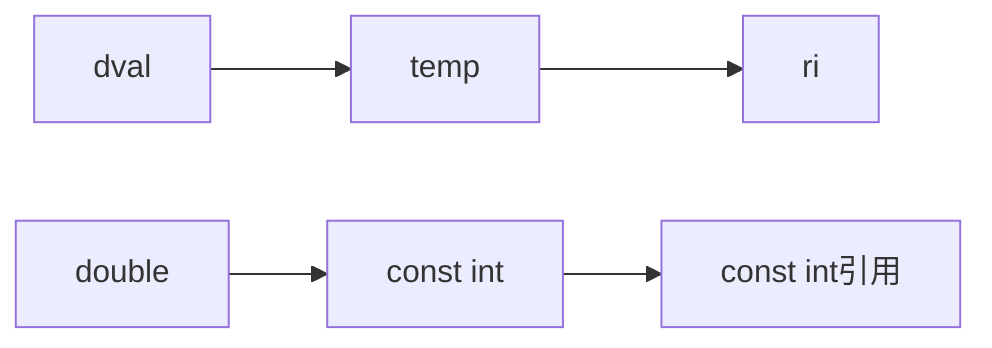

# const限定符

## const对象

- *const*对象一旦创建后就不能再改变，所以const对象**必须初始化**
- 初始值可以是任意复杂的表达式
- *extern*关键字可在一个文件中定义*const*对象，而在其他多个文件中声明并使用

## 常量表达式

- 定义：是指**值不会改变**，并且**编译过程**就能得到计算结果的表达式
- 字面值是常量表达式
- constexpr声明
  - 声明为constexpr的变量一定是一个常量，必须用常量表达式初始化
  - 是c++11的新规

## const引用

- <font color="red">const引用，是一种操作限定，即不允许通过const引用修改绑定对象</font>
- const引用对于引用本身是不是常量未作限定
  - 可以绑定**非常量对象**
  - 可以绑定**字面值**
  - 可以绑定**表达式**

```c++
const int ci = 1024;
const int &r1 = ci;  // 正确
r1 = 42;  // 错误：r1是对常量的引用
int &r2 = ci;  // 错误：试图让一个非常量的引用指向一个常量对象 
```

对以上代码的理解：

- r1是对常量的引用，所以不能通过引用去改变ci,常量引用可以
- 最后一行代码中，r2是非常量引用，ci是常量引用所以不能赋值

```c++
double dval = 3.14;
const int &r1 = dval;  // 引用类型与引用不一致的特殊情况
```

引用类型通常与引用对象一致，以上代码为**例外**情况,这种情况编译器创建一个**int临时量**对象 **temp**，**r1**引用**temp**。  



当ri不是const引用时，按照引用的原理，**int** 类型的ri可以改变 **double**类型的dval的值，c++将这种行为归为**非法**

```c++
int i = 42;
int &r1 = i;  // 定义r1为i的普通引用
const int &r2 = i;  // 定义r2为i的const引用
r1 = 0;  // r1相当于i的别名
r2 = 0;  // 错误
```

## 指针和const

- `int *ptr` **普通指针**指向普通对象

### 指向const的指针
  - `const int *ptr` 
  - <font color="red">没有规定所指对象必须是一个常量</font>, 可以指向常量,也可以指向普通对象
  - 仅仅是**不能通过该指针改变所指对象**
  - ptr的类型是const int*
  - 指向const引用和指针，**不能**修改指向或引用对象的值，修改**普通对象**的值**可以**修改const引用或const指针指向的值,属于底层const
  
```c++
const double pi = 3.14;
double *ptr = &pr;
const double *cptr = &pi;
*cptr = 42;
```

### const指针
  - 指针本身是个常量，属于顶层const
  - `int *const ptr;`表示一个指向**普通**int对象的const指针
  - `const int *const ptr`表示一个指向**const** int对象的const指针

  ```c++
  const double pi = 3.14159;
  const double *const piptr = &pi;  // piptr是一个const指针，指向const double(双精度浮点常量)类型的对象
  ```

  - 表示ptr是一个const指针,指向一个int对象

## 顶层const和底层const

> 区分顶层const和底层const的问题:**指针本身是不是常量和指针所指是不是常量的问题**

- **顶层const**：
  - 可以是任意对象的常量
  - <font color="red">指针本身是个常量</font>
  - `const int a = i;`中的const是一个顶层const
- **底层const**：
  - 一般是复合类型
  - <font color="red">指针所指可以是常量，也可以是普通对象</font>
  - 指针和引用类型的const，可以通过修改指向的对象或引用对象的值被改变
  - ```const int &a = i;``` 中的const是一个底层const