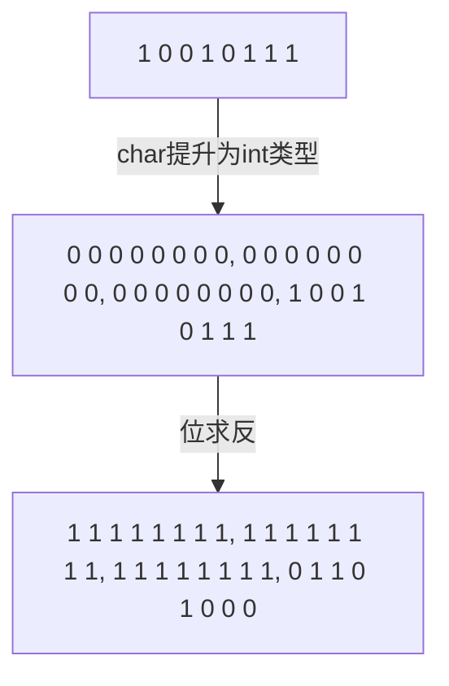

# 运算符

[[递增递减]]

[[位运算符]]

[[sizeof运算符]]

[[类型转换]]


### 1. 递增递减

- 前置
  - 得到加1/减1后的值
  - 建议使用前置版本
- 后置
  - 除非必须，否则不用递增递减运算符的后置版本
  - 在一条符合表达式中既加1/减1又使用它原来的值, 使用i++/i--

### 2. 位运算符

- 运算对象是整数类型
- 友元关系不能传递
- 建议仅用来处理无符号类型
- 可以处理带符号类型，符号位的值可能会改变，因此是一种未定义行为

#### 移位运算符

- "<<", ">>"
- **左侧运算对象**按照**右侧运算对象**要求移动指定位数
- IO库定义的"<<", ">>"是重载版本
- 左移运算符(<<)在右侧插入值为0的二进制位
- 右侧运算符的行为则依赖于左侧运算对象的类型
  - 无符号类型，左侧插入0
  - 有符号类型，左侧插入0或符号位副本，视具体环境而定
- 移位运算符优先级比**算术运算符**低，比**关系运算符、赋值运算符、条件运算符**高。

#### 位求反运算符

```c++
unsigned char bits = 0227;  // 1 0 0 1 0 1 1 1
~bits;  // 1 1 1 1 1 1 1 1 1 | 1 1 1 1 1 1 1 1 | 1 1 1 1 1 1 1 1 | 0 1 1 0 1 0 0 0 |
```



- 将1变0，将0变1

### 3. sizeof运算符

- 返回表达式或类型名字所占的内存空间大小, 得到一个**size_t**类型
- 满足右结合律
- sizeof返回值是一个常量表达式，所以可以用来声明数组的维度

### 4. 类型转换

- c++不会将两个不同类型的值直接相加
- 隐式转换由编译器自动执行
- 隐式转换尽量不损失精度
- 隐式转换发生条件
  - 比int类型小的整型值提升为较大的整数类型
  - 在**条件**中，非bool值转换bool类型
  - 初始化过程，初始值转变为变量类型
  - 赋值语句中，右侧运算对象转换左侧对象类型
- 多对象，多类型运算中，转换成同一类型
- 转换成bool，指针或算数类型值为0，转换成false

`int val = 3.14 + 3;`
3.14是double，3先转换成double和3.14相加得到double, int对象初始化，将double去掉小数点变为int

### 成员访问运算符

- 点运算符"."
- 箭头运算符"->"