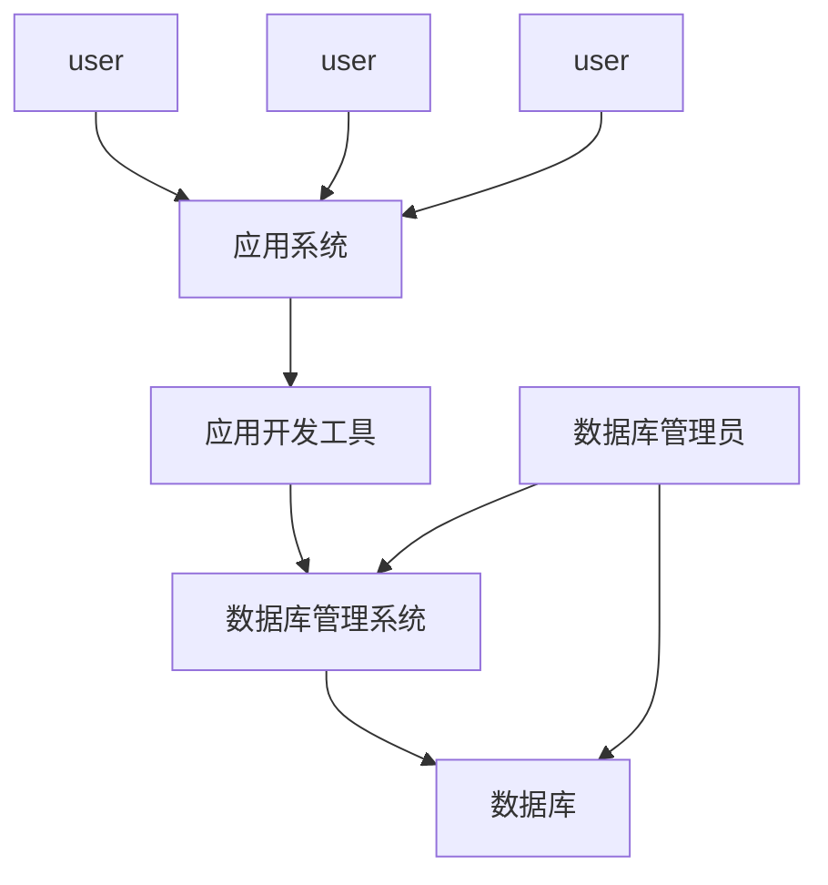

# 概念

## database

- 用多个table组成

## table

- 行和列组成的表, 
  - 列: 不同字段
  - 行: 一行表示一条数据

## what is mysql

- MySql属于基于客户机-服务器的DBMS(数据库管理系统)
- MySql服务是一个进程，区别于SQLite依附于应用程序

## Mysql组件

- [[MySql命令行程序]]
- MySql Administrator 简化管理服务器
- MySql Query Browser 编写和执行MySql命令