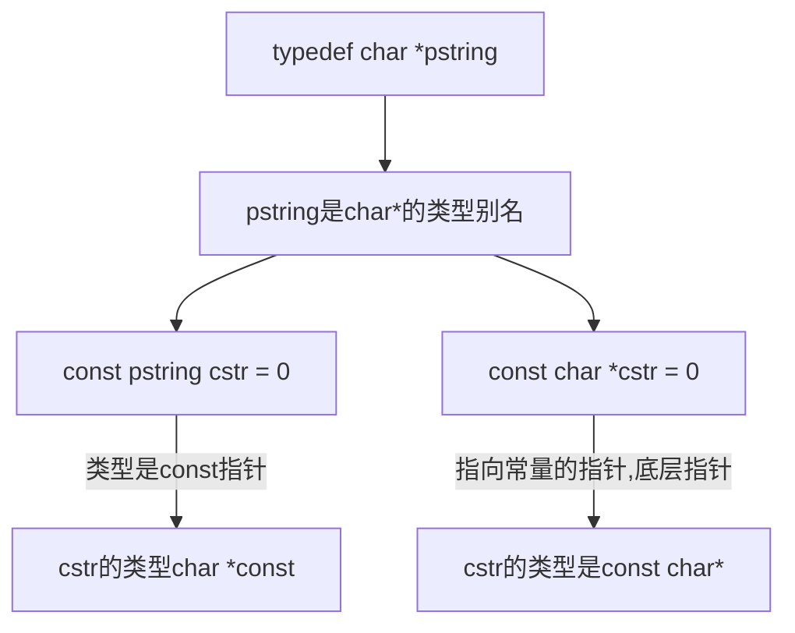
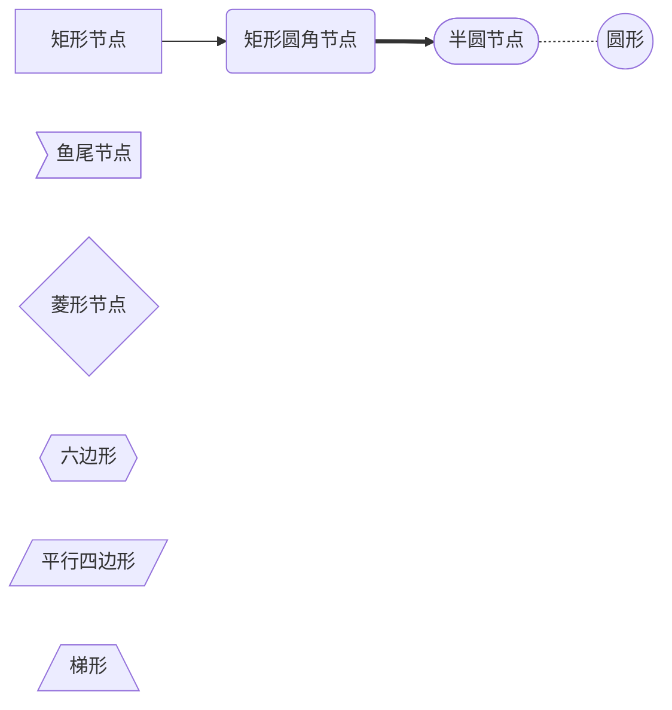
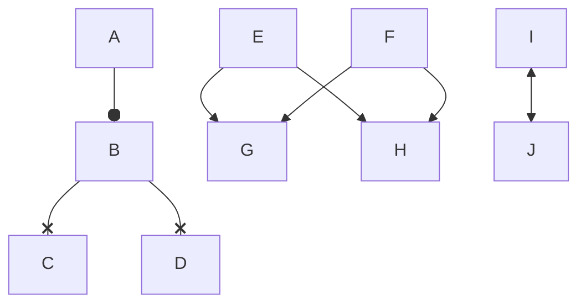

# 画图语法

## mermaid

- graph 流程图
  - graph TD
  - graph TB
  - graph LR

> T:Top, B and D: Bottom, L and R: Left and Right

- stateDiagram 状态图







## sequence

```sequence
left -> right : left ot right
Note right of right:right context
Note left of left:left content
```