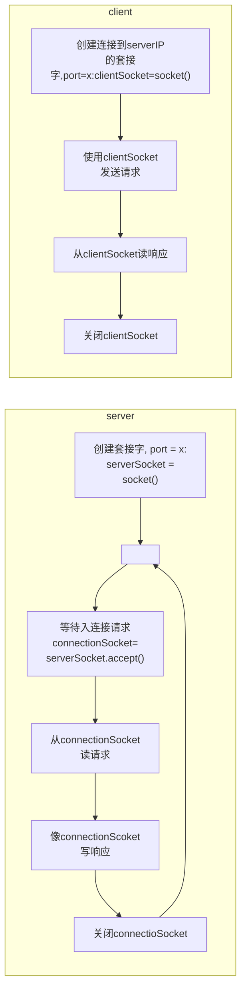

# TCP套接字编程

[UDP套接字编程](UDP套接字编程.md)

[socket](socket.md)

[套接字](套接字.md)



TCPClient.py

```python
from socket import *  
  
serverName = 'servername'  
serverPort = 12000  

clientSocket = socket(AF_INET, SOCK_STREAM)  

# 创建套接字

clientSocket.connect((serverName, serverPort))  

# 服务器名称，服务器端口

sentence = input('Input lowercase sentence:')  

# 从用户端获得输入，放入变量sentence

clientSocket.send(sentence.encode())  

# 发送socket to Server

modifiedSentence = clientSocket.recv(1024)  

# 接收套接字，1024是缓存长度

print('From Server: ', modifiedSentence.decode())  
clientSocket.close()
```

TCPServer.py

```python
from socket import *  
  
serverPort = 12000  
serverSocket = socket(AF_INET, SOCK_STREAM)  

# 创建Socket

serverSocket.bind(('', serverPort))  

# 将服务器端口serverPort与套接字关联

serverSocket.listen(1)  

# 让服务器聆听来自客户的TCP连接请求

print('The server is ready to receive')  

while True:  
    connectionSocket, addr = serverSocket.accept()  
    
    # 创建客户专用的套接字connectionSocket
    
    sentence = connectionSocket.recv(1024).decode()  
    
    # 接收用户发送的字节
    
    capitalizedSentence = sentence.upper()  
    connectionSocket.send(capitalizedSentence.encode())  
    connectionSocket.close()
```