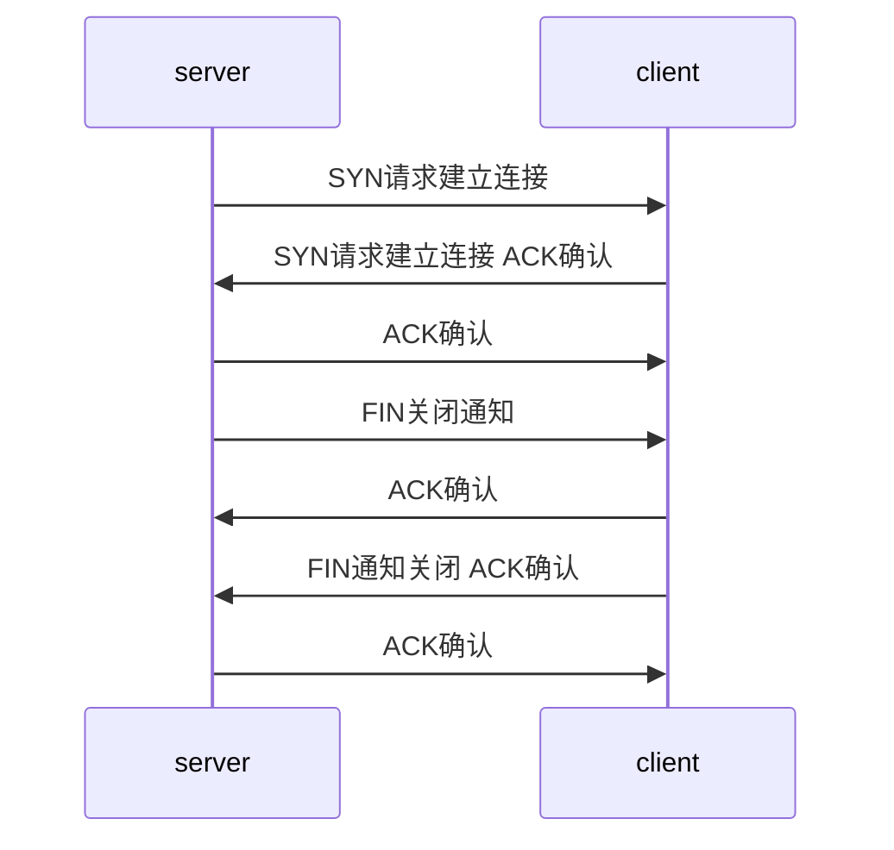

# TCP状态转移

- TCP连接在任一时刻都处于某种状态
- TCP状态
  - LISTEN: 被动等待客户连接状态, 
    - 客户端在SYN_RCVD状态接收到[RST](tcp报文头部结构.md)报文
    - 服务端调用[listen()](linux-socket-api-listen()函数.md)
  - CLOSED: 
    - 服务端在LASK_ACK接收ACK报文
  - SYN_RCVD: 
    - 客户端在SYN_SENT状态接收SYN 或 发送SYN, ACK
    - 服务端在LISTEN状态接收RST 或 发送SYN, ACK
  - SYN_SENT:
    - 客户端在CLOSED调用[connect()](linux-socket-api-connect()函数.md), 发送[SYN](tcp报文头部结构.md)报文
  - ESTABLISHED: 连接双方能够进行双向数据传输的状态
    - 服务端在SYNRCVD状态接收[ACK](tcp报文头部结构.md)报文
    - 客户端在SYN_SENT状态接收SYN,ACK 或 发送ACK
  - CLOSE_WAIT: 客户端主动关闭连接, 
    - 服务器在ETABLISH发送[ACK](tcp报文头部结构.md)或接收FIN报文进入CLOSE_WAIT
  - LAST_ACK:等到客户端对结束报文段的最后一次确认，一旦确认完成，连接彻底关闭
    - 服务端在close_wait状态发送[FIN](tcp报文头部结构.md)报文

> Linux中通过[netstat](netstat.md)命令可以查看当前状态

## 常规流程

> 实线表示服务器，虚线表示客户端

// ```mermaid
// flowchart TD
// A([CLOSED])
// B([LISTEN])
// C([SYN_SENT])
// D([SYN_RECV])
// E([ESTABLISHED])
// F([CLOSE_WAIT])
// G([LAST_ACK])
// H([FIN_WAIT_1])
// I([FIN_WAIT_2])
// J([TIME_WAIT])
// A -.调用listen进入LISTEN.-> B
// A --调用connect函数,发送SYN j--> C
// B -.收到SYN j,响应ACK j+1,SYN k.->D
// D -.收到ACK k+1,accept函数返回socket.-> E
// E -.服务器收到客户端的FIN x,响应ACK x+1.-> F
// F -.隐式调用close函数,发送FIN y.-> G
// G -.收到FIN y+1, TCP连接彻底关闭.-> A
// C --收到ACK j+1,SYN k,ACK k+1--> E
// E --调用close函数,发送FIN x--> H
// H --收到ACK x+1--> I
// I --收到FIN y,响应ACK y+1--> J
// J --> A
// ```

## 三次握手四次挥手

- 服务端接收到请求断开(FIN)报文后, 服务端不一定立即关闭socket，所以先回复收到确认(ACK)报文

