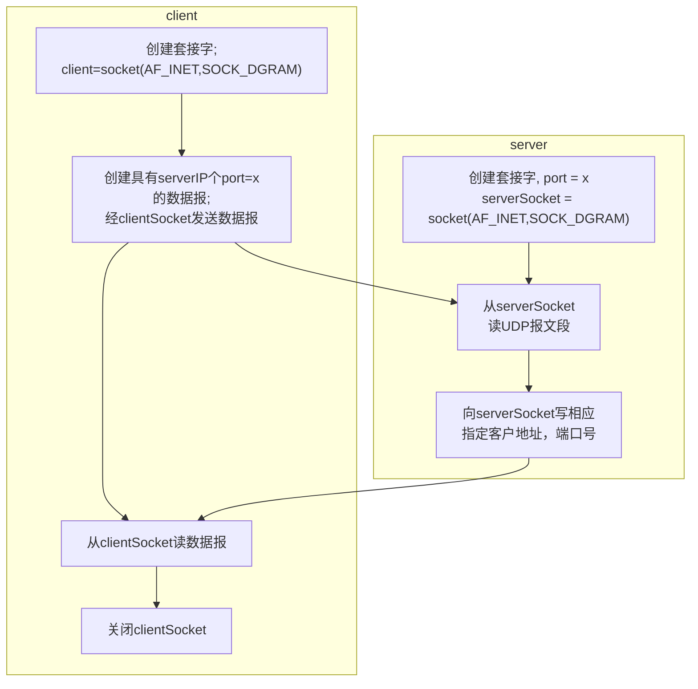

# UDP套接字编程

[UDP](udp.md)

[computer-network-socket](computer-network-socket.md)



UDPClient.py

```python
from socket import * 
  
serverName = 'hostname' # 

serverPort = 12000 # 

clientSocket = socket(AF_INET,SOCK_DGRAM)

# AF_Inet表示使用IPv4协议,
# SOCK_DGRAM:套接字类型，这是一个UDP套接字

message = input('Input lowercase sectence:')

# 相当于c++中的std::cin,将输入的信息存入变量message中

clientSocket.sendto(message.encode(), (serverName, serverPort))

# sentto为报文附上目的地址,并发送分组
# 使用encode()方法将message转换为字节类型,

modifiedMessage, serverAddress = clientSocket.recvfrom(2048)

# 接收套接字，2048缓存长度

print(modifiedMessage.decode())
clientSocket.close()
```

UDPServer.py

```python
from socket import *

serverPort = 12000  # 端口号
serverSocket = socket(AR_INET, SOCK_DGRAM)

# 

serverSocket.bind(('', serverPort)

# 

print("The server is ready to receive")
while True:
    message, clientAddress  = serverSocket.recvfrom(2048)
	# 当分组到达服务器时，数据存放在message中，客户地址放在clientAddress
	modifiedMessage = massage.decode().upper()
	# 转成字符串后大写
	serverSocket.sendto(modifiedMessage.endcode(), clientAddress)
	# 字符串转字节发送

```