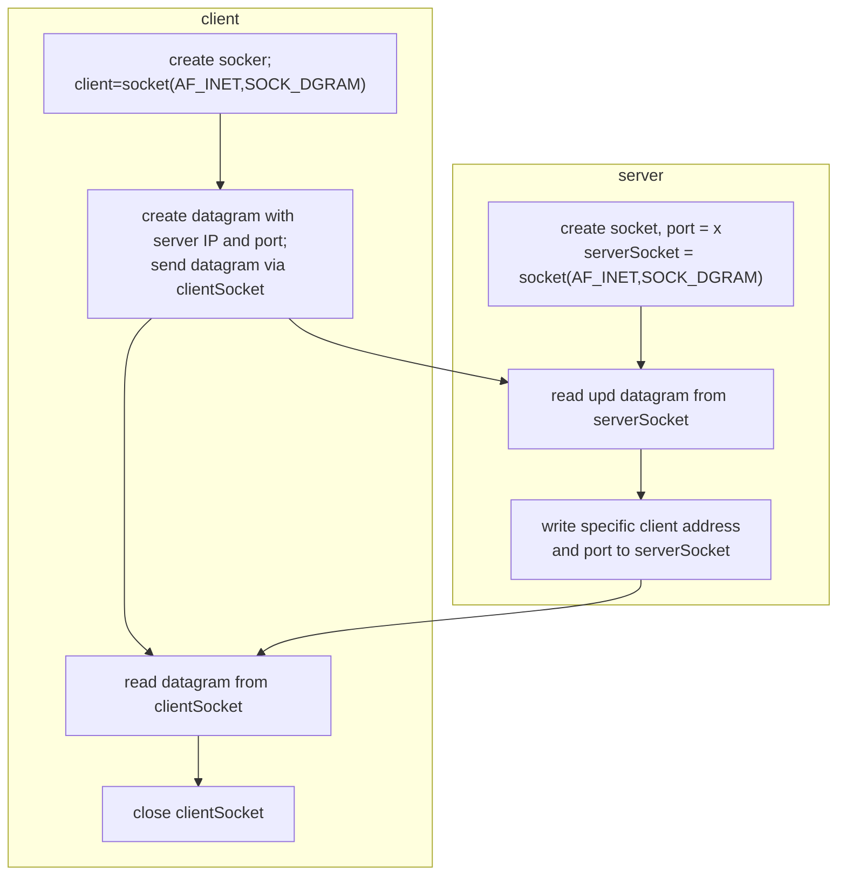

# Computer Network - UDP Socket Programming



UDPClient.py

```python
from socket import *

serverName = 'hostname' #
serverPort = 12000 #
clientSocket = socket(AF_INET,SOCK_DGRAM)

# AF_Inet represents the Internet address family for IPv4
# SOCK_DGRAM: socket type, this particular socket is used for UDP

message = input('Input lowercase sectence:')

# equivalent to std::cin in c++, store the input message in variable message

clientSocket.sendto(message.encode(), (serverName, serverPort))

# sentto() method attaches the destination address (serverName, serverPort) to the message and sends the resulting packet into the process's socket
# encode() method returns the encoded version of the string

modifiedMessage, serverAddress = clientSocket.recvfrom(2048)

# receive socket is called clientSocket, the buffer size is 2048 bytes

print(modifiedMessage.decode())
clientSocket.close()
```

UDPServer.py

```python
from socket import *

serverPort = 12000
serverSocket = socket(AR_INET, SOCK_DGRAM)

serverSocket.bind(('', serverPort)

print("The server is ready to receive")
while True:
    message, clientAddress  = serverSocket.recvfrom(2048)
	# when a packet arrives, the data is placed into message, and the client address is placed into clientAddress
	modifiedMessage = massage.decode().upper()
	# convert the message to uppercase
	serverSocket.sendto(modifiedMessage.endcode(), clientAddress)
	# send the modified message back to the client
```