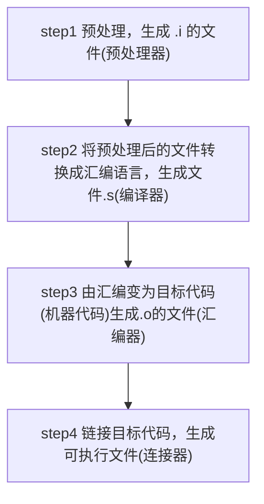

# GCC

- 全称GNU Compiler Collection
- 能编译多种语言
- 支持多种硬件平台
- mingw是Minimalist GNU for Windows
- gcc/g++分别是c/c++的编译器

## gcc/g++编译过程

- 源文件 $\longrightarrow$ 预处理 $\longrightarrow$ 编译汇编$\longrightarrow$ 链接
- .cpp $\longrightarrow$ .i $\longrightarrow$ .s(汇编) $\longrightarrow$.o([目标文件](C_ObjectFile.md))$\longrightarrow$  可执行文件
- 链接
  - 处理静态库、动态库阶段, 连接成可执行程序
  - GNU中[ld](GNU_linker.md)命令设置连接选项
  - 连接库文件格式
    - 静态链接库: .a(UNIX)/.lib (windows) 
    - 动态链接库: .so(UNIX)/.dll(windows)

## 参数

- `-o`: 执行完整编译过程, 编译生成的[[可执行文件(executablefile)]]并命名为file

  > `gcc -o executable_file sourcefile` 
  
- `-S`:执行前两步，编译生成汇编代码,对应文件后缀.s

  > `gcc -S sourcefile` 
  
- `-E`:只激活预处理

  > `gcc -E hello.c > hello.txt`
  
- `-v`
- `-c`: 执行前三步，编译源文件但不链接，生成后缀名为.obj或.o的目标文件 

  > `gcc -c hello.c`

## 文章  

[gcc构建动态链接库](GCC_Build_Shared_Libraries.md)
