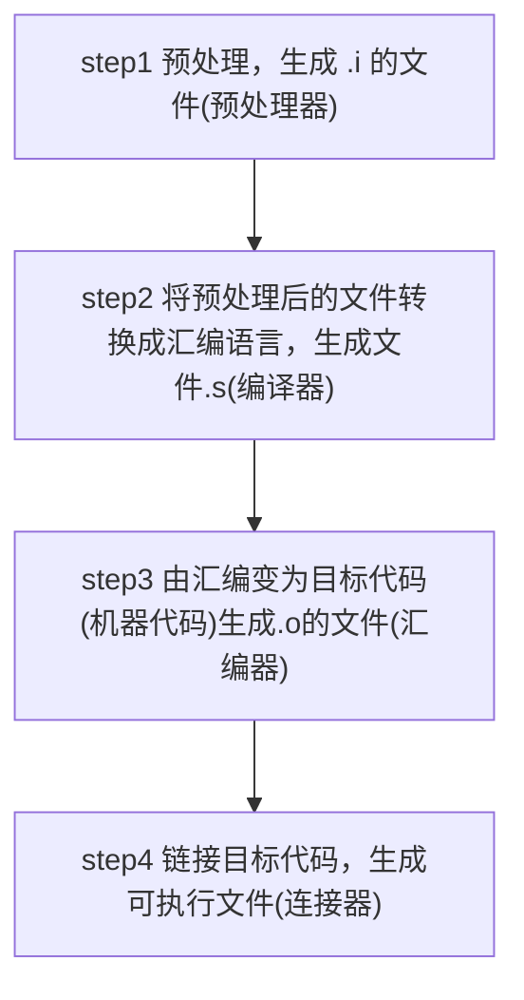

# GCC

## What It Is

- gcc mean GNU Compiler Collection
- gcc/g++ respectly is GNU C/C++ Compiler

> mingw: Minimalist GNU for **Windows**

## Feature

- multi-language support
- multi-platform support

## Compilation process of gcc/g++

compile process

- source file ⮕  preprocess ⮕  compile $\longrightarrow$ link ⮕  executable file

corresponding file suffix

- .cpp ⮕ .i ⮕ .s(assemble) ⮕ .o([object file](c-objectfile.md)) ⮕  binary file

what is link

- handling static and dynamic libraries, and link them to create an executable program.
- In the GNU environment, the [ld command](gnu-linker.md) is used to set linking options.
- The formats for linking library files are as follows:
  - Static Linking Library: .a (UNIX) / .lib (Windows)
  - Dynamic Linking Library: .so (UNIX) / .dll (Windows)

## Options

`-o`

- `gcc -o executable_file sourcefile`
- running **complete** compile process, generate file with postfix `.exe` or `.out`
- this file called [executable file](executable-file.md)

`-S`

- `gcc -S sourcefile`
- running first two steps, generate file with postfix `.s`
- this file called [assembly file](c-assembly.md)

`-E`:

- `gcc -E hello.c > hello.txt`
- only active the preprocess step

`-v`

`-c`

- running first three steps, but not link, generate file with postfix `.obj` or `.o`
- this file called [object file](c-objectfile.md)

`gcc -c hello.c`

## related article

[gcc build shared lib](gcc-build-shared-libraries.md)
