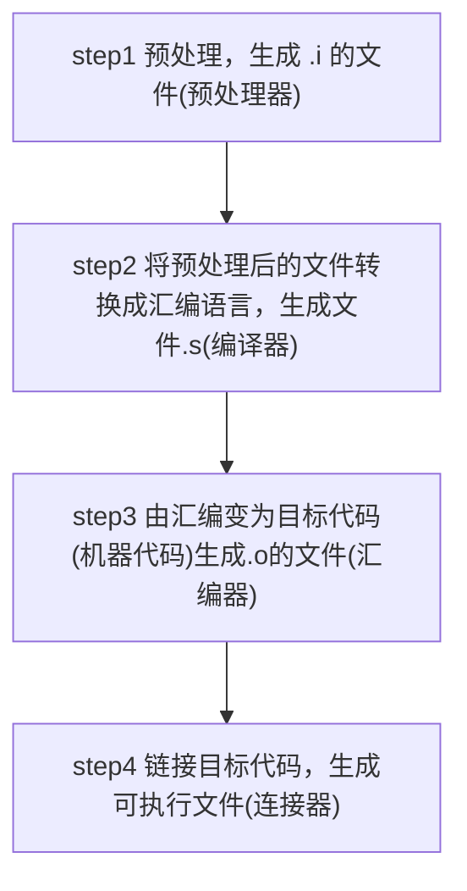

# GCC

- 全称GNU Compiler Collection
- 能编译多种语言
- 支持多种硬件平台
- mingw是Minimalist GNU for Windows
- gcc/g++分别是c/c++的编译器

## gcc/g++编译过程

- 源文件 $\longrightarrow$ 预处理 $\longrightarrow$ 编译汇编$\longrightarrow$ 链接
- .cpp $\longrightarrow$ .i $\longrightarrow$ .s(汇编) $\longrightarrow$.o([目标文件](c-objectfile.md))$\longrightarrow$  可执行文件
- 链接
  - 处理静态库、动态库阶段, 连接成可执行程序
  - GNU中[ld](gnu-linker.md)命令设置连接选项
  - 连接库文件格式
    - 静态链接库: .a(UNIX)/.lib (windows) 
    - 动态链接库: .so(UNIX)/.dll(windows)

## Options

`-o`

- `gcc -o executable_file sourcefile`
- running **complete** compile process, generate file with postfix `.exe` or `.out`
- this file called [executable file](executable-file.md)

`-S`

- `gcc -S sourcefile`
- running first two steps, generate file with postfix `.s`
- this file called [assembly file](c-assembly.md)

`-E`:

- `gcc -E hello.c > hello.txt`
- only active the preprocess step

`-v`

`-c`

- running first three steps, but not link, generate file with postfix `.obj` or `.o`
- this file called [object file](c-objectfile.md)

`gcc -c hello.c`

## related article

[gcc build shared lib](gcc-build-shared-libraries.md)
