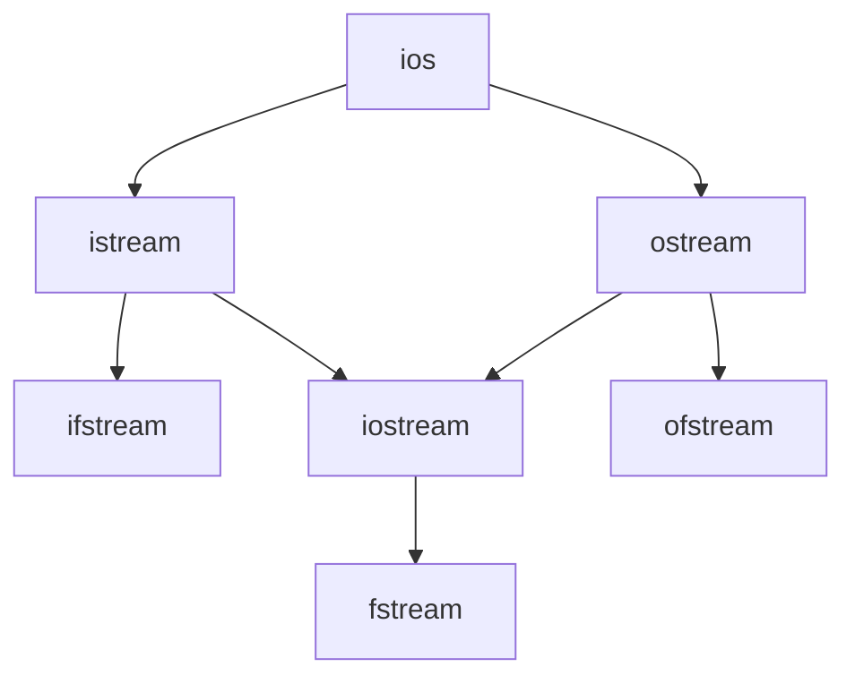

# IO类

[[c++手册#IO类型的条件状态]]

[iostream的条件状态](c++-iostream-条件状态.md)

[[操作IO类的函数]]

[文件输入输出](c++-fstream.md)

[getline函数](c++-iostream-getline.md)

[string流](c++-string-stream.md)

- IO对象无拷贝和赋值
- IO类的继承关系
  - istream: 接收盘输入数据
    - cin是istream类的对象
  - ostream: 输出数据到屏幕
    - cout是ostream类的对象
    - cerr也是ostream类的对象
  - ifstream: **读取**文件中的数据
  - ofstream: 用于向文件中**写入**数据
  - iostream: 继承自istream类和ostream类, 既能输入又能输出
  - fstream: 兼ifstream和ofstream类, 既能读取文件的数据，又能向文件中写入数据

