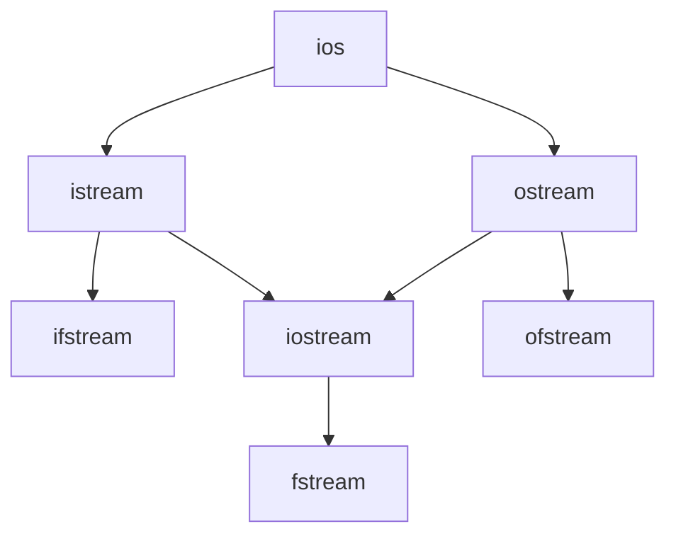

# IO类

[[c++手册#IO类型的条件状态]]

- IO对象无拷贝和赋值
- IO类的继承关系
  - ios是流类的系欸
  - istream: 接收盘输入数据
    - cin是istream类的对象
  - ostream: 输出数据到屏幕
    - cout是ostream类的对象
    - cerr也是ostream类的对象
  - ifstream: **读取**文件中的数据
  - ofstream: 用于向文件中**写入**数据
  - iostream: 继承自istream类和ostream类, 既能输入又能输出
  - fstream: 兼ifstream和ofstream类, 既能读取文件的数据，又能向文件中写入数据




## 条件状态

- 状态
  - strm::iostate
  - strm::badbit
  - strm::failbit
  - strm::eofbit
  - strm::goobit
- 查看状态  
  - s.eof()
  - s.fail()
  - s.bad()
  - s.good()
- 管理状态
  - s.clear()
  - s.clear(flags)
  - s.setstate(flags)

## 操作IO类的函数

- getline函数，从一个给定的istream读取一行数据，存入string对象
  - `getline(input, str, delim)`
  - input: 获取数据来源的流
  - str: 目标字符串
  - delim: 使出所终止于的分割字符，释出但不存储
- 缓冲区：一个存储区域，用于保存数据
  - 显示的刷新会**输出**缓冲
- 条件状态对象是流
- `>>`运算符，从istream读取数据, `cin >> word;` 表示从cin读取输入存入word
- `<<`运算符, 向ostream写入输出数据, `cout << word;` 表示向cout写入word并用于输出

   ```c++
   ofstream out1, out2;
   out1 = out2;
   ofstream print(out1);  
   out2 = print(out2);  // 不能作为实参，因为不支持拷贝
   ```

## 文件输入输出

```c++
ifstream in(file); // 构造一个ifstream并打开file
ofstream out;  // 创建一个输出文件流，为关联任何文件
```

- 成员函数
  - open
  - close
  
```c++  
ifstream in(ifile);
ofstream out;
out.open(ifile + ".copy");
```