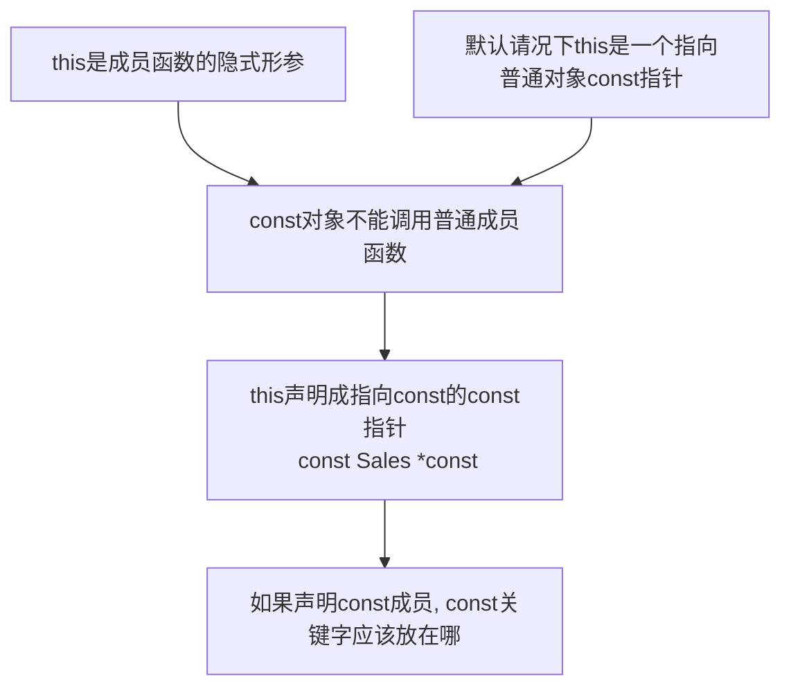

# const成员函数

```c++
int func() const {}
```

- 表示成员函数的隐式参数this不能修改类的数据成员
- const成员函数**不允许**修改类的数据成员
- 对于在函数体内不改变this所指对象的成员函数，将this声明成`const Sales_data *const`有助于函数的灵活性
- 允许把const关键字放在成员函数的参数列表之后




## 基于const的重载

- 因为const对象不能调用普通成员函数