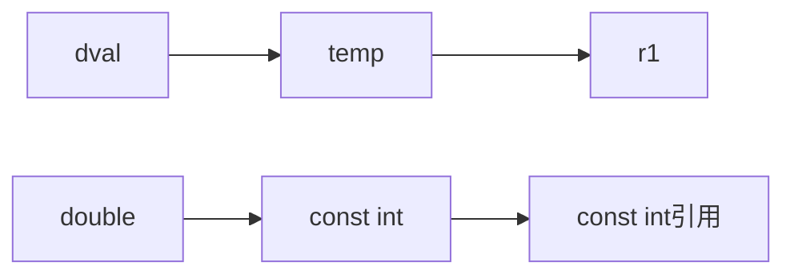

# const引用

- <font color="red">const引用，是一种操作限定，即不允许通过const引用修改绑定对象</font>
- const引用对于引用本身是不是常量未作限定
  - 可以绑定**非常量对象**
  - 可以绑定**字面值**
  - 可以绑定**表达式**

```c++
const int ci = 1024;
const int &r1 = ci;  // 正确
r1 = 42;  // 错误：r1是对常量的引用
int &r2 = ci;  // 错误：试图让一个非常量的引用指向一个常量对象 
```

对以上代码的理解：

- r1是对常量的引用，所以不能通过引用去改变ci,常量引用可以
- 最后一行代码中，r2是非常量引用，ci是常量引用所以不能赋值

```c++
double dval = 3.14;
const int &r1 = dval;  // 引用类型与引用不一致的特殊情况
```

引用类型通常与引用对象一致，以上代码为**例外**情况,这种情况编译器创建一个**int临时量**对象 **temp**，**r1**引用**temp**。  



当ri不是const引用时，按照引用的原理，**int** 类型的ri可以改变 **double**类型的dval的值，c++将这种行为归为**非法**

```c++
int i = 42;
int &r1 = i;  // 定义r1为i的普通引用
const int &r2 = i;  // 定义r2为i的const引用
r1 = 0;  // r1相当于i的别名
r2 = 0;  // 错误
```