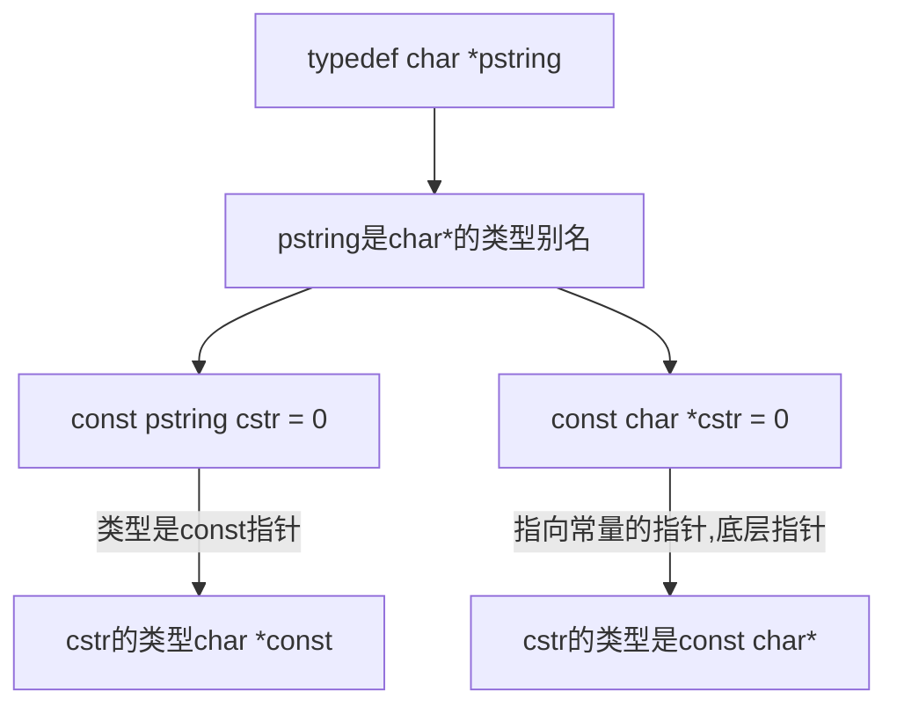
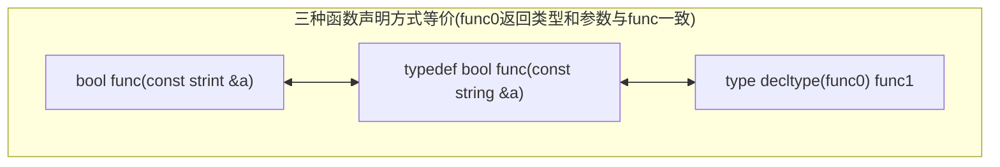

# c++知识点整理

## 左值右值

- 左值持久；右值短暂
- 赋值语句左侧的一定是左值，右侧可以是左值也可是右值
- 以下运算符的求值结果左值
  - 内置解引用运算符
  - 下标运算符
  - 迭代器解引用运算符
  - string和vector的下标运算符
  - 前置递增/递减
- 函数返回值是右值
- 左值引用 符号&
- 右值引用 符号&&

### 1. 左值  

> 关键词：*地址*  *持久*

- 通常说的引用是指左值引用  

### 2. 右值

> 关键词：*临时*

- 右值是字面值  
- 右值可能是[[寄存器]]内的值也可能是立即数
- 函数的返回值

```c++
int i = 42;   
int &r = i;  // 正确
int &&rr = i;  // 错误：i是左值
int &r2 = i * 42;  // 错误：i*42是右值
const int &r3 = i * 42;  // const引用即可绑定右值又可绑定左值
int &&rr2 = i * 42;  // 右值引用绑定右值，没问题
```

## 深拷贝浅拷贝

### 1.深拷贝与浅拷贝的区别

- 深拷贝  
  - 拷贝所有成员，为所有成员分配空间  
- 浅拷贝  

- 在删除对象时会有区别  

### 2. 拷贝构造函数

```c++
class Foo {
public:  // 关键字public
    Foo();  // 默认构造函数
    Foo(const Foo&);  // 拷贝构造函数
};
```  

- 拷贝构造函数的参数  
如果参数不是引用类型，为了调用拷贝构造函数，我们必须拷贝他的实参,我们又要调用拷贝构造函数，如此又要无限循环

### 3. 拷贝初始化(深拷贝）在以下情况会发生

- 用`=`定义变量时
- 将一个对象作为实参传递给一个非引用类型的形参
- 从一个返回类型为非引用类型的函数返回一个对象
- 用花括号列表初始化一个数组中的元素或一个[[聚合类]]

## 引用和指针

对比学习
| 指针 | 引用 |
| -- | -- |
| 指针是对象 | 引用不是对象 |
| 类型是 class* | 没有类型 |
| 可以重新赋值 | 必须初始化,不能重新赋值 |
| 解引用* | 操作符& |

## typedef, auto, decltype

```c++
typedef char* pstring;  // pstring 是char*的别名
const pstring cstr = 0;  // cstr的类型是: char const* 表示指向char的指针, char const* cstr
const char* cstr = 0;  // 
const pstring *ps;
```



```c++
type bool func(const string &a, const string &b)  // 声明funcshi函数类型
```

### typedef可以简化函数声明，增加可读性


