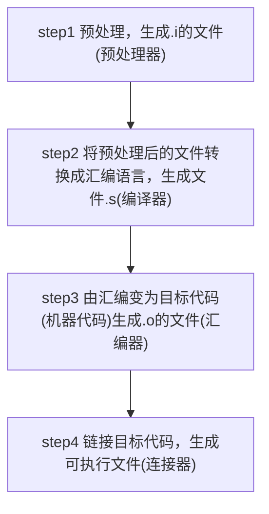

# c++编译器

## GCC

- 全称GNU Compiler Collection
- 能编译多种语言
- 支持多种硬件平台
- mingw是Minimalist GNU for Windows
- gcc/g++分别是c/c++的编译器

### gcc/g++编译过程

- 源文件
- 预处理
- 编译
  - 生成汇编
- 汇编
- 链接
  - 处理静态库，动态库阶段,连接成可执行程序
  - 连接库文件格式.a/.lib, .so/.dll
  
### 静态库

- `.a`文件
- 可以看作一组目标文件(.o)的集合
- 在**编译时**完成连接，此后再无瓜葛
- 浪费空间和资源，因为所有相关的目标文件于牵涉到的函数库被链接成一个可执行文件
- `ar -crv libstaticmath.a StaticMath.o`,由目标文件生成静态库文件libstaticmath.a
- 若静态库更新所有使用它的文件都需要重新编译
  
### 动态库

- `.so`文件
- 在**程序运行时**才被载入
- 因此更新时只需更新相应动态库
- 可以实现进程之间的共享，因此也成为共享库
- 简化程序更新
- 可以由程序员在代码中控制调用
- Linux下gcc编译的执行文件默认是ELF格式，不需要初始化入口，不需要函数特别声明
- Windows系统下执行文件格式PE格式，动态库需要一个DllMain函数做初始化入口，  
  通常在导出函数的声明时需要有_declspec(dllexport)关键字

### 参数

- -o
  - `gcc -o file` 执行完整编译过程, 编译生成的可执行文件并命名为file
- -S
  - `gcc -s sourcefile` 执行前两步，编译生成汇编代码
- -E
  - `gcc -E hello.c > hello.txt`只激活预处理
- -v
- -c
  - `gcc -c hello.c`执行前三步，编译源文件但不链接，生成后缀名为.obj或.o的目标文件

## MSVC

- 微软的c++编译器

## clang