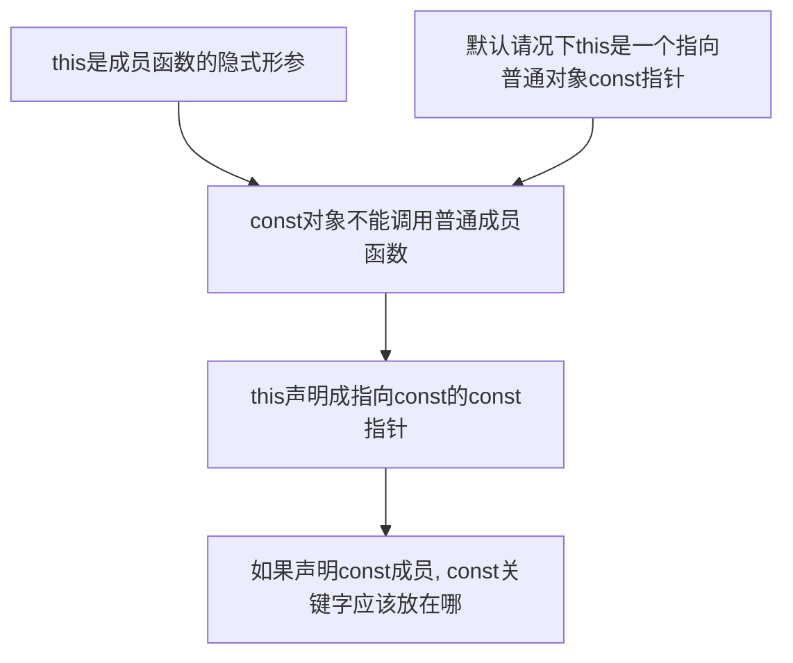

# this

- 隐式**形参**
- 成员函数有各自的this形参声明
- 任何对类成员的直接访问都被看做this的隐式引用
- 默认情况下 **this** 是一个**const指针**，不允许改变**this**中保存的地址
  [[const限定符#const指针]]
  - 默认情况下形参this声明为:`Sale_data *const this;` this指向的是普通Sale_data对象
  - `const Sale_data *const this`, this是指向const Sale_data对象的指针
- `return *this`的成员函数
  - 返回值为当前对象的**引用**
  - 若函数改变了对象某个成员的值, 相当于更新当前对象
  - 无需访问某个具体成员，而是当成一个整体来返回
  - 无需改变成员时可以将函数定义为const成员函数，返回const引用

```c++
Sales_data& Sales_data::combine(const Sales_data& rhs)
{
    units_sold += rhs.units_sold;
    revenue += rhs.revennue;
    return *this;
}
total.combine(trans);  // 更新total当前值，返回total的引用
// trans是一个Sales_data对象
```

## const成员函数

- const成员函数**不允许**修改类的数据成员
- 允许把const关键字放在成员函数的参数列表之后
- 外观：`int func() const {}`


