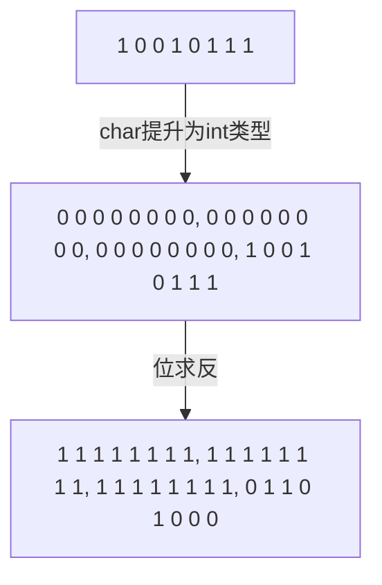

# 位运算符

- 运算对象是整数类型
- 友元关系不能传递
- 建议仅用来处理无符号类型
- 可以处理带符号类型，符号位的值可能会改变，因此是一种未定义行为

## 移位运算符

- 左移运算符`<<`, 右移运算符`>>`
- **左侧** 运算对象按照右侧**运算对象**要求移动指定位数
- IO库定义的`<<, >>`是重载版本
- 左移运算符`<<`在右侧插入值为0的二进制位
  - 相当于乘2
- 右侧运算符的行为则依赖于左侧运算对象的类型
  - 无符号类型，左侧插入0
  - 有符号类型，左侧插入0或符号位副本，视具体环境而定
  - 可以理解为除2
- 移位运算符优先级比**算术运算符**低，比**关系运算符、赋值运算符、条件运算符**高。

## 位求反运算符

- `~`

```c++
unsigned char bits = 0227;  // 1 0 0 1 0 1 1 1
~bits;  // 1 1 1 1 1 1 1 1 1 | 1 1 1 1 1 1 1 1 | 1 1 1 1 1 1 1 1 | 0 1 1 0 1 0 0 0 |
```



- 将1变0，将0变1

## 异或运算符

- 对应位置有且只有一个1，则该位为1，否则为0