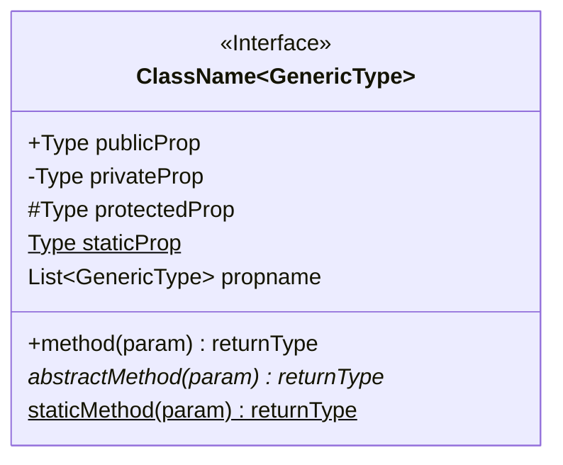
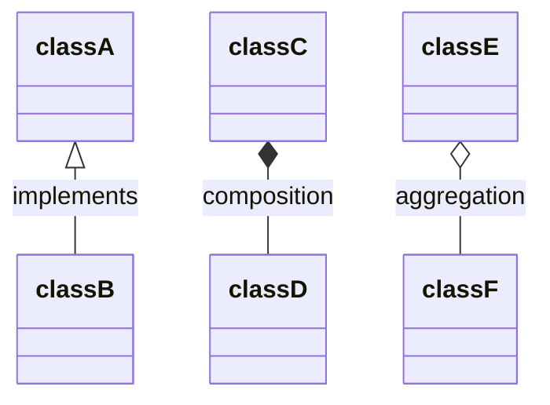

# Mermaid - ClassDiagram

## Define Class

- `<<Interface>>` is annotation of class, other annotation is `<<Abstract>>`, `<<Service>>`, `<<Enumeration>>`

## Define Classes RelationShip

Relationship Arrow

- `--|>`: [Inheritance](uml.md#———▷-inheritance)
- `..|>`: [Realization](uml.md#---▷-implementation)
- `-->`:  [Association](uml.md#——󰁔-one-way-association)
- `*--`:  [Composition](uml.md#󰣏———-composition))
- `o--`:  [Aggregation](uml.md#󱀝———-aggregation)
- `--`:  [Association](uml.md#———-association)
- `..>`:  Dependency
- `..`:   Link (Dashed)

Label Relationship

- `[classA][arrow][classB]:labeltext`

