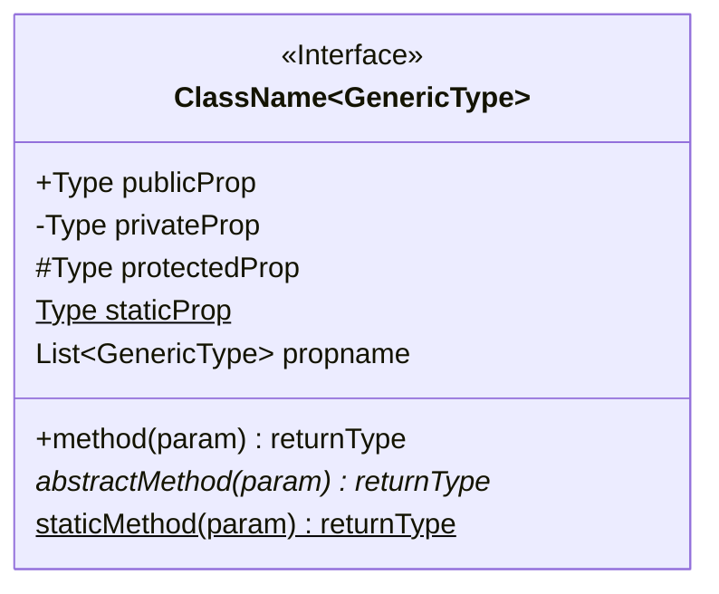
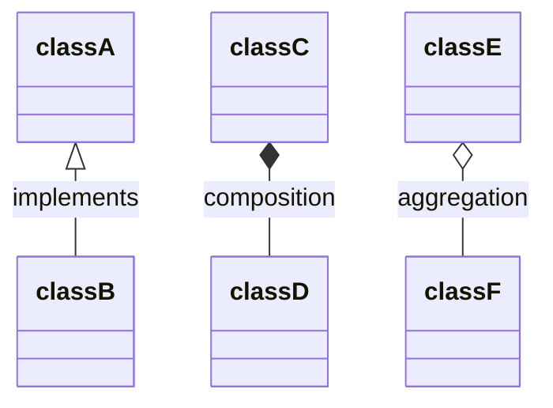

# Mermaid - ClassDiagram

## Define Class

- `<<Interface>>` is annotation of class, other annotation is `<<Abstract>>`, `<<Service>>`, `<<Enumeration>>`

## Define Classes RelationShip

- `<|--`: [Inheritance](uml.md#———▷-inheritance)
- `*--`:  [Composition](uml.md#󰣏-black-diamond-(composition))
- `o--`:  [Aggregation](uml.md#󱀝-clear-diamond-(aggregation))
- `-->`:  [Association](uml.md#󰁔-arrow-solid-line:-association)
- `--`:   [Link (Solid)](uml.md#line-without-arrow)
- `..>`:  Dependency
- `..|>`: [Realization](uml.md#---▷-implementation)
- `..`:   Link (Dashed)

label Relationship

- `[classA][arrow][classB]:labeltext`

