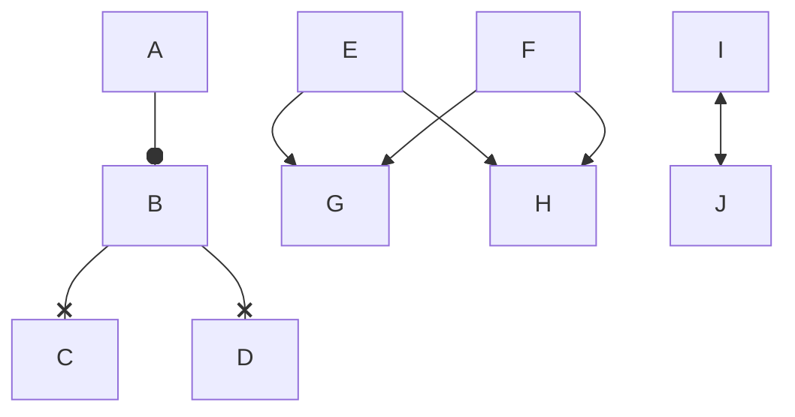
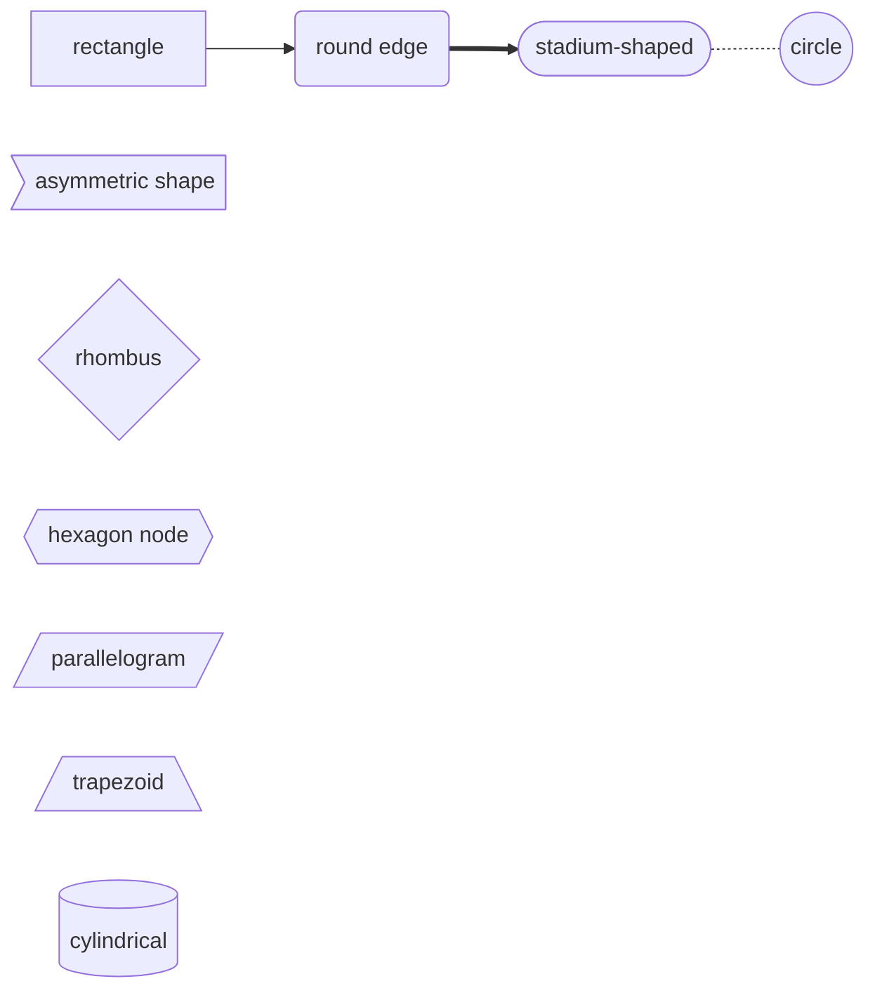
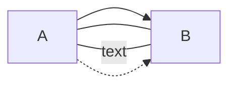

# Mermaid

* [Flowchart](#flowchart)
* [stateDiagram](#statediagram)
* [sequence](#sequence)
* [classdiagram](#classdiagram)

## Flowchart



flowchart TB represents flow direction other available options:

- flowchart TD
- flowchart TB
- flowchart LR

> T:Top, B and D: Bottom, L and R: Left and Right

Node Shape



Link Style



## stateDiagram

## sequence

```sequence
left -> right : left ot right
Note right of right:right context
Note left of left:left content
```

## classdiagram

[classDiagram](mermaid-classdiagram.md)

