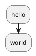
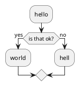

# Plantuml - Activity Diagram

## Take A Look

```plantuml
@startuml
:hello;
:world;
@enduml
```

conditional syntax

- `if (...) then (...)` 
- `if (...) is (...) then`
- `if (...) equals (...) then`

```plantuml
@startuml
:hello;
if (is that ok?) then (yes)
    :world;
else (no)
    :hell;
endif
@enduml
```
