# Plantuml - Class Diagram

* [Take A Look](#take-a-look)
* [Declaring Class Elements](#declaring-class-elements)
* [Relation](#relation)
* [Link Line Style Detail](#link-line-style-detail)
* [Help On Layout](#help-on-layout)
* [Label On Relation](#label-on-relation)
* [Using non-letters](#using-non-letters)
* [Remove Classes And Restore Class](#remove-classes-and-restore-class)
* [Generic](#generic)
* [Specific Icon](#specific-icon)
* [Package](#package)
* [Namespaces](#namespaces)
* [Lollipop Interface](#lollipop-interface)
* [Arrows From/To Members](#arrows-from/to-members)
* [Grouping Inheritance](#grouping-inheritance)
* [Inline Style](#inline-style)

## Take A Look

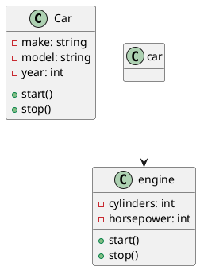

## Declaring Class Elements

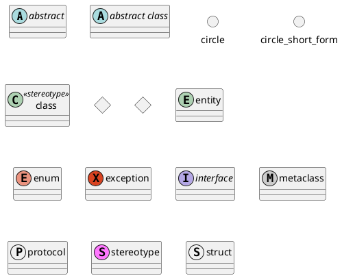

Elements Default Treated As Class Elements

- elements in [package](#package) are default class element
- elements linked by some class-only [relation](#relation)

## Relation

- [Extension](uml.md#---▷-implementation): `<|--`, `<|-[plain]-`
- [Inheritance](uml.md#———▷-inheritance): `<|..`, `<|-[dashed]-`
- [Composition](uml.md#———󰣏-composition): `*--`
- [Aggregation](uml.md#———󱀝-aggregation): `o--`
- [Association](uml.md#——-association): `--`, `--[plain]--`
- [One Way Association](uml.md#——󰁔-one-way-association): `<--`

Keywords  `implements` and `extends`

- `implements` and `extends` are are used at class declaration

```plantuml
@startuml
class Foo implements Bar {

}
Foo extends Bar ' raise syntax error
@enduml
```

Changing Arrow Orientation

- by default, use two dashes `--` to represent Relation
- use single dash `-` to horizontal orientation

```plantuml
Room o- Student
Room *-- Chair
@enduml
```

- use `left`, `right`, `up`, `down` to change arrow orientation

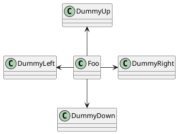

> with `left to right direction` will rotate the orientation

relate two classes

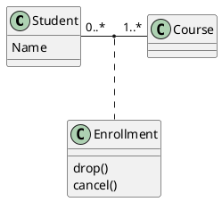

## Link Line Style Detail

link line type definition

- `-[bold]->`
- `-[dashed]->`
- `-[dotted]->`
- `-[hidden]->`
- `-[plain]->`
- `-[red]->`
- `-[thickness=4]->`

inline style

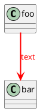

## Help On Layout

why layout need help

- sometimes, the default layout is not pertect

keyword `together` and `[hidden]`

- keyword `together` try to group classes
- keyword `[hidden]` help on group layout

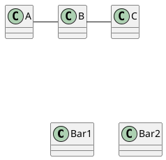

## Label On Relation

add on the middle of the line

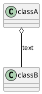

add on one side

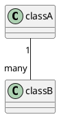

## Using non-letters

To using [non-letters](unicode.md#non-letters) class name

- use `as` keyword in the class definition to assign an alias 

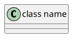

## Remove Classes And Restore Class

- both `hide` and `remove` can be used to remove classes
- useful when [`!include file`](plantuml-preprocessing.md#include-files) and want to remove some classes after file inclusion

remove class by name

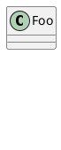

remove class by tag

- tag an element with `$tag` at the end of the element definition

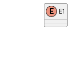

remove by wildcard and restore specific class by tag

```plantuml
@startuml
class C1 $foo $bar
enum E1
interfae I1 $foo
C1 -- I1
remove *
restore $foo
@enduml
```

Remove Unlinked Class

- use `@unlink` to represent unlinked class

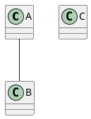

Name Starting With `$` Can Not Be Hidden Or Removed

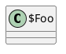

## Generic

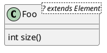

## Specific Icon

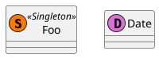

## Package

- use `package` keyword

```plantuml
@startuml
package "Classic Collection" #DDDDDD {
    Object <|-- ArrayList
}
package com.plantuml {
    Object <|00 Demo1
}
@enduml
```

Auto Created Package

- define separator `::` using `set separator ::`

```plantuml
set separator ::
class X1::X2::foo {
 some info
}
```

Package Style

- ...

## Namespaces

## Lollipop Interface

```plantuml
@startuml
class Foo
bar ()- foo
@enduml
```

## Arrows From/To Members

- `Foo::propA --> Bar::propB`

## Grouping Inheritance

merge all arrow heads using [`skinparam groupInheritance`](plantuml-command.md#skinparam)

- `skinparam groupInheritance 1`(no grouping)
- `skinparam groupInheritance 2`(grouping two)
- `skinparam groupInheritance 3`(grouping three)
- ...

## Inline Style

```
@startuml
class Foo #palegreen ##[dashed]green
@enduml
```


