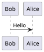

# Plantuml - Command

## Title

- `title simple title\nexampe`

## Comment

```plantuml
' comment
```

## Block Comment

```plantuml
/'
line 1
line 2
'/
```

## Footer And Header

## Skinparam

- used to set global colors of background, font, border, etc

list all skinparam

- option 1: `help skinparams` or `skinparameters`

```plantuml
@startuml
help skinparams
skinparameters
@enduml
```

- options 2: command line `java -jar plantuml.jar -language`

```sh
java -jar plantuml.jar -language
```


## Legend Diagram

- A legend is a box containing text

## Scale

- `scale 1.5`
- `scale 2/3`
- `scale 200 width`
- `scale 200 height`
- `scale 200*100` 
- `scale max 300*200`
- `scale max 1024 width`
- `scale max 800 height`

For example




