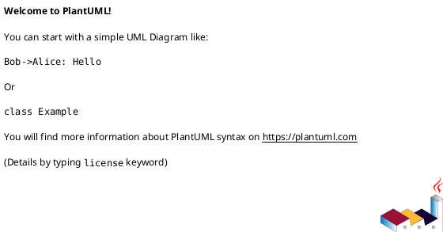
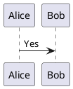
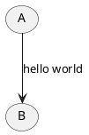
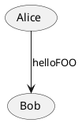
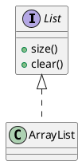
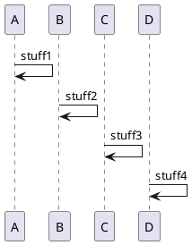
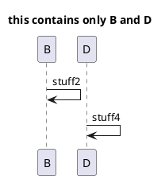
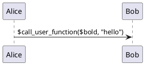

# Plantuml - Preprocessing

* [What It Is](#what-it-is)
* [Variables](#variables)
* [logical operators](#logical-operators)
* [logical function](#logical-function)
* [Conditional](#conditional)
* [While Loop](#while-loop)
* [Procedure](#procedure)
* [function](#function)
* [Unquoted Procedure Or Function](#unquoted-procedure-or-function)
* [Include Files](#include-files)
* [Built-in Functions](#built-in-functions)
* [Logging](#logging)
* [Memory dump](#memory-dump)
* [Assertion](#assertion)

## What It Is

very similar to [C preprocessor](c-preprocessor.md) but use `!` instead of `#`

## Variables

- recommended to start a variable name with a `$`

> but it is not mendatory

defining a variable



define a variable if it is not defined


change variable value 

- actually, it is redefine the variable


variable operation

- depending on the type of the variable
  - `string`, `string`: string concatenation
  - `string`, `int`: string concatenation
  - `int`, `int`: integer operation
  - ...

## logical operators

- `&&`
- `||`

## logical function

- `%false()`
- `%true()`
- `%not()`

## Conditional

!if, !elseif, !else, !endif



## While Loop

directives

- !while, !endwhile

```plantuml
@startuml
!$a = 3
!while $a > 0
    :$a;
    !$a = ($a - 1)
!endwhile
@enduml
```



## Foreach Loop

```plantuml
@startuml
!$list = ["a", "b", "c"]
* root
foreach $item in $list
  **$item
endfor
@enduml
```

## Procedure

> like a [macro](c++-preprocess.md##define)
> or a [function](#function) return void

- variables defined in the procedure are default local
- arguments should be quoted by default

directives

- !procedure, !endprocedure

Syntax

```plantuml
!procedure names(param)
// do something...
!endprocedure
```

Example



## function

- create a local variable with keyword `!local` if a global variable with the same name
- arguments should be quoted by default
directive - !function, !endfunction, !return
example

```plantuml
!function $double($a)
    !return $a + $a
!endfunction
```

## Unquoted Procedure Or Function

- `!unquote` keyword to indicate that a [function]() or a [procedure]() does not require a quotes for its argument



## Include Files

directive

- !include

include from plantuml file

- `list.iuml`



- include in another file

```plantuml
@startuml
!include list.iuml
@enduml
```

include plantuml block from text file

- plantuml block is text like this `@startuml...@enduml`
- if a text file contains multiple plantuml blocks
  - include first block by `!include file.txt!0`
  - include by id: for `@startuml(id=BLOCK_ID)` by `!include file.txt!BLOCK_ID`


## Include File Subpart 

declare a subpart with `!startsub`, `!endsub`

- `foo.puml`



- `foo.puml` will rendered as no subpart introduced

include subpart from `foo.puml`

- `bar.puml`

```plantuml
@startuml
title this contains only B and D
!includesub foo.puml!BASIC
@enduml
```

- this file will rendered exactly as if: 



## Import Library

include a set of plantuml files into a single [.jar](java-jar-file.md) or .zip archive

- with directive `!import` to import a library
- with directive `!include` to include a file from the library

```plantuml
@startuml
!import /path/to/library.jar
!include subpath/file.iuml
@enduml
```

## Add Include Search Path

- search path property is `plantuml.include.path`
- specify the search path by java option [`-Dplantuml.include.path=PATH1;PATH2;...`](java-command-java-options.md#standard-options) in command line

```sh
java -Dplantuml.include.path="c:/mydir" -jar plantuml.jar file.txt
```

## Built-in Functions

- built-in functions names starts by `%`

## Logging

- for debug

directive

- !Logging

```plantuml
@startuml
!function $bold($text)
!$result = "<b>" + $text + "</b>"
!log Calling bold function with $text. The result is $result
!return $result

Alice -> Bob : This is $bold("bold")
Alice -> Bob : This is $bold("a second call")
@enduml
```

## Memory dump

- kind of debug

directive

- `!dump_memory`

What's for? I don't know

## Assertion

- for debug

directives

- `!assert`

```plantuml
@startuml
Alice -> Bob : Hello
!assert %strpos("abcdef", "cd")==3 : "This always fails"
@enduml
```

## Argument Concatenation

- append text to a macro argument using `##`

```plantuml
@startuml
!unquoted procedure COMP_TEXTGENCOMP(name)
[name] << Comp >>
interface ifc <<IfcType>> As name##Ifc
name##Ifc - [name]
!endprocedure
COMP_TEXTGENCOMP(dummy)
@enduml
```



## Dynamic invocation

`%invoke_procedure(procedure, params)` 

- `procedure`: name of the procedure to be invoked
- `params`: list of parameters to be passed to the procedure

```
@startuml
!procedure $go()
Bob -> Alice : hello
!endprocedure
!$wrapper = "$go"
$invoke_procedure($wrapper)
```

`$call_user_function(function, params)`

- `function`: name of the function to be invoked
- `params`: list of parameters to be passed to the function




