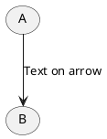
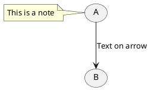

# Plantuml - Sequence Diagram

Flow Diagram(Use Case Diagram)

- use parentheses to wrap the component

```plantuml
@startuml
(A) --> (B): Text on arrow
@enduml
```

Add notes

```plantuml
@startuml
(A) --> (B): Text on arrow
note left of A: This is a note
@enduml
```
