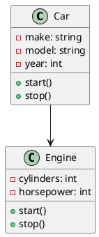

# PlantUML

```plantuml
@startuml
class Car {
  - make: string
  - model: string
  - year: int
  + start()
  + stop()
}

class Engine {
  - cylinders: int
  - horsepower: int
  + start()
  + stop()
}

Car --> Engine
@enduml
```
