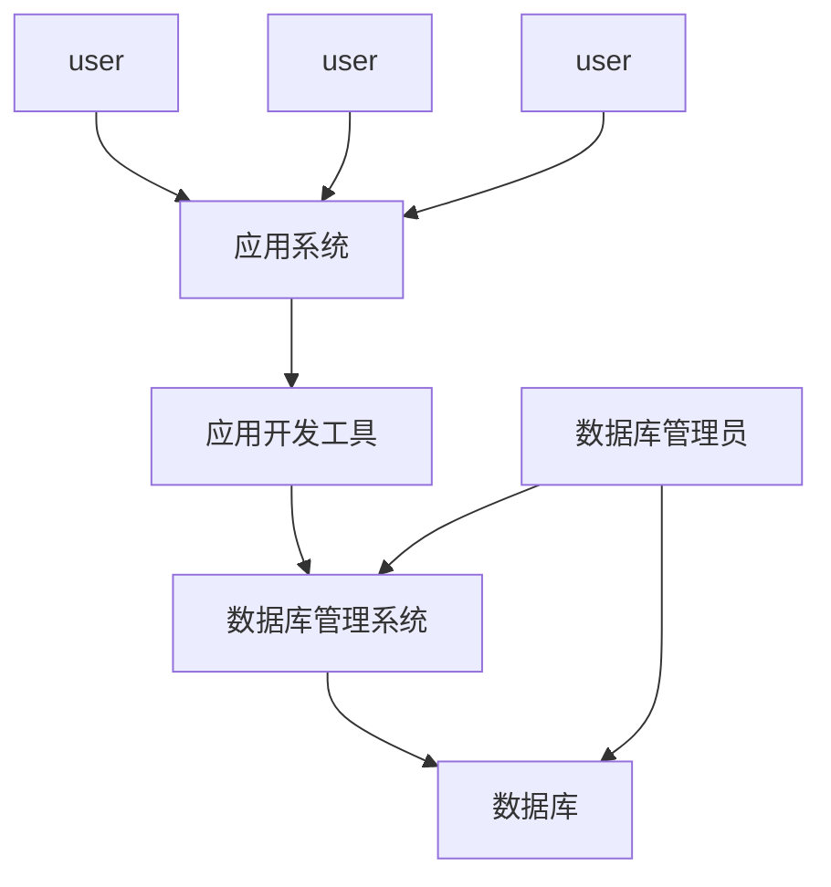

# concept
- MySql属于基于客户机-服务器的DBMS(数据库管理系统)

```mermaid
flowchart TB
A1[user]
A2[user]
A3[user]
B[应用系统]
C[应用开发工具]
D[数据库管理系统]
E[数据库管理员]
F[数据库]
A1 --> B
A2 --> B
A3 --> B
B --> C
C --> D
D --> F
E --> D
E --> F
```

## Mysql组件

- [[MySql命令行程序]]
- MySql Administrator 简化管理服务器
- MySql Query Browser 编写和执行MySql命令