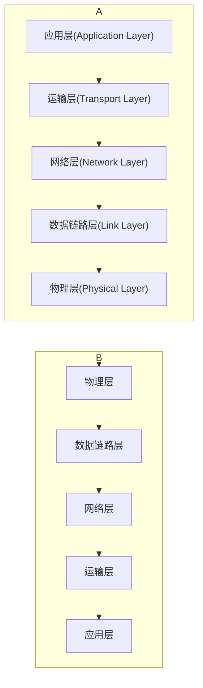

# TCP/IP体系

[[TCP]] [[IP协议]]

- 数据是如何传输的
  - 应用程序数据,  比如[[HTTP报文]]
  - TCP/UDP头部 + 应用程序数据 
     [[TCP报文头部结构]] [[运输层报文段]]
  - IP头部 + TCP/UDP头部 + 应用程序数据  
     [[IPv4数据报]]
  - 以太网头部 + IP头部 + TCP/UDP头部 + 应用程序数据
     [[帧]]