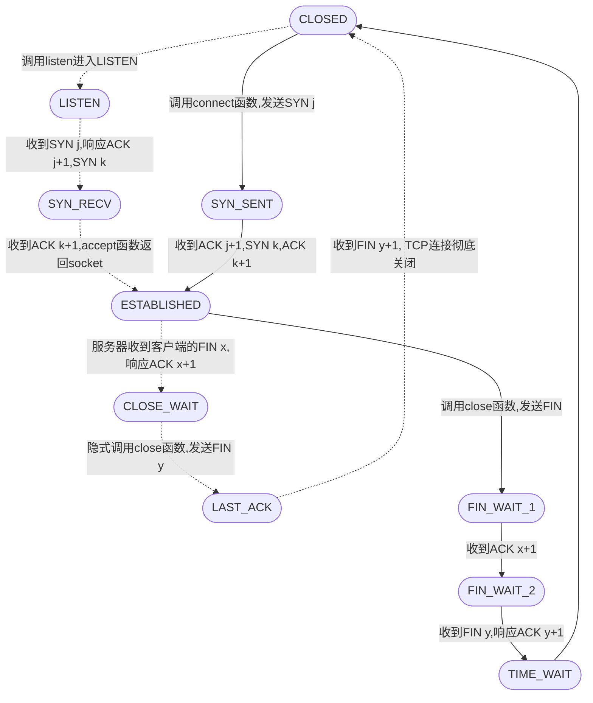
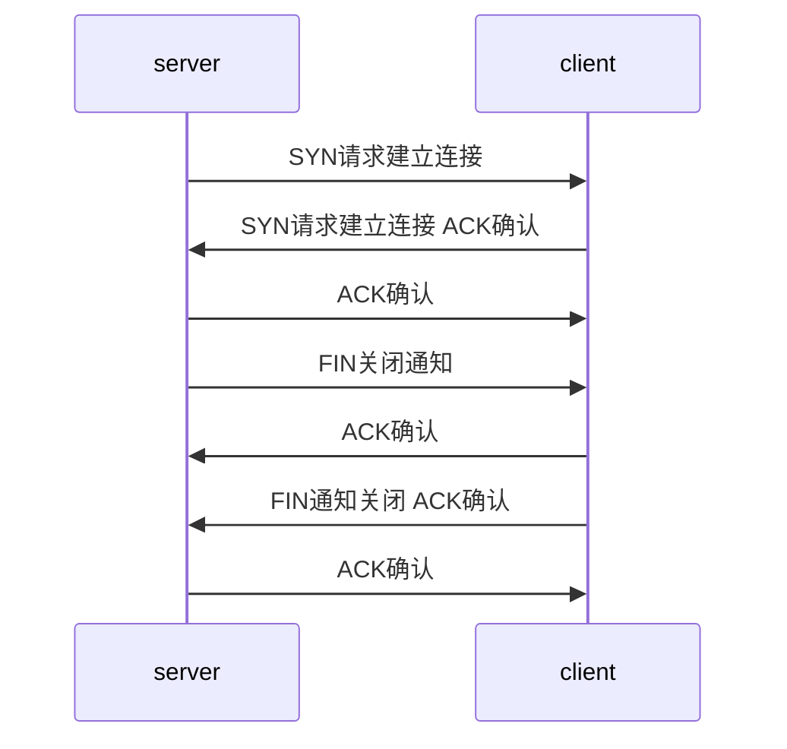

# TCP状态转移

- LISTEN: 被动等待客户连接状态
- CLOSED: 
- SYN_RCVD: 
- ESTABLISHED: 连接双方能够进行双向数据传输的状态
- SYN_SENT: 
- CLOSE_WAIT: 客户端主动关闭连接, 服务器返回ACK报文进入CLOSE_WAIT,
- LAST_ACK:等到客户端对结束报文段的最后一次确认，一旦确认完成，连接彻底关闭

## 常规流程

> 实线表示服务器，虚线表示客户端

