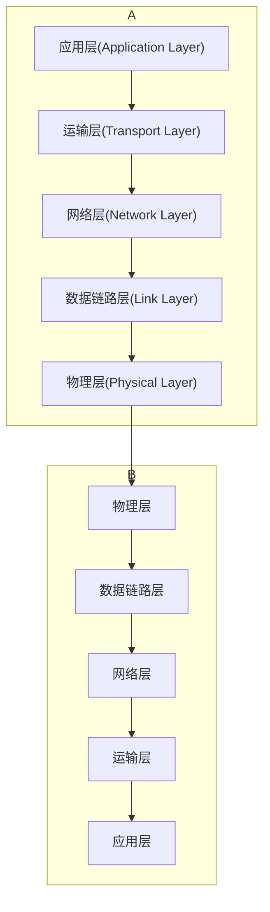

# TCP/IP体系结构

```mermaid
flowchart TB
subgraph A
A1["应用层(Application Layer)"]-->B1["运输层(Transport Layer)"]
B1 --> C1["网络层(Network Layer)"]
C1 --> D1["数据链路层(Link Layer)"] 
D1 --> E1["物理层(Physical Layer)"]
end
subgraph B
direction TB
E2[物理层] --> D2[数据链路层]
D2 --> C2[网络层]
C2 --> B2[运输层]
B2 --> A2[应用层]
end
E1 --> E2
```

- 网络适配器(网卡)包括了数据链路层和物理层