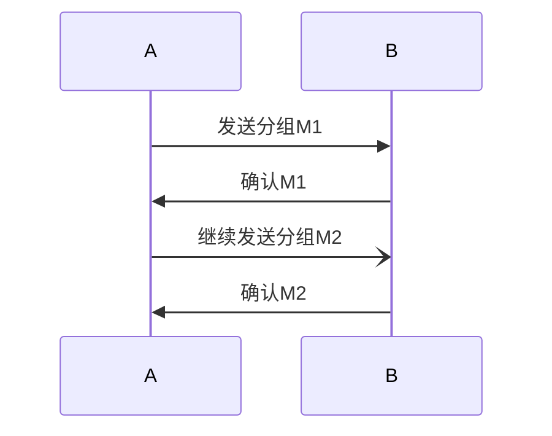
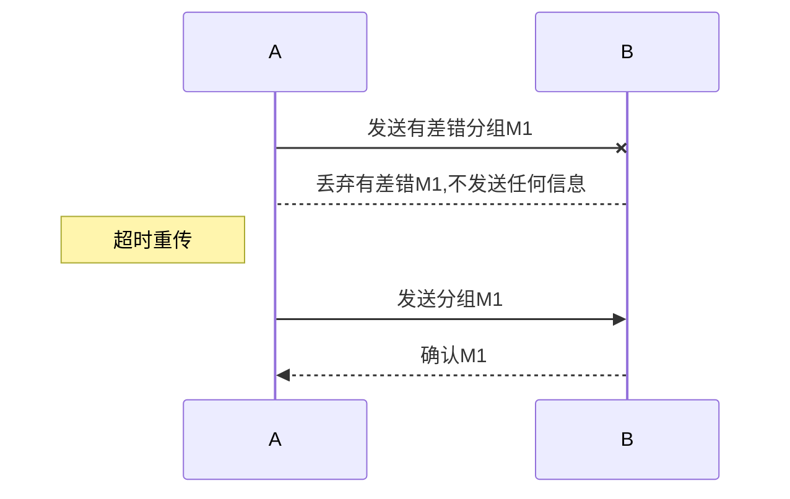
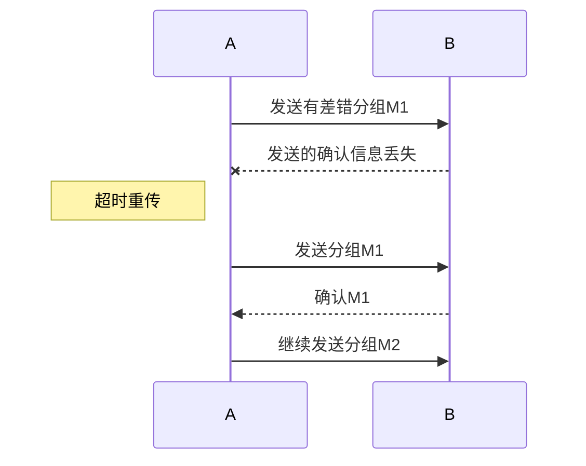

# 可靠传输工作原理

## 停止等待协议

[[分组]]

- 每发送完一个分组就停止发送，等待对方确认，在收到确认后在发送下一个
  - A发送完一个后，暂时保留已发送分组的副本
  - 分组和确认分组都必须进行编号
  - 超时计时器设置的重传时间应当比数据在分组传输的平均往返时间更长
  [[超时重传]]

- 不返回信息

- B发送的的确认信息丢失
  1. A重传
  2. B丢弃重复的M1
  3. 向A发出确认 

- B发送的确认信息迟到 
  1. A重传
  2. B丢弃重复的M1

## 连续ARQ协议

- 发送方维持一个发送窗口，窗口中的分组都可连续发送出去, 而不需要等待对方确认, 提高[[信道利用率]]
- 发送方每收到一个确认，就把发送窗口向前滑动一个分组位置
- 接收方不必逐个发送确认，只对收到的最后一个分组发送确认，表示当前分组和在这之前的分组都已正确收到