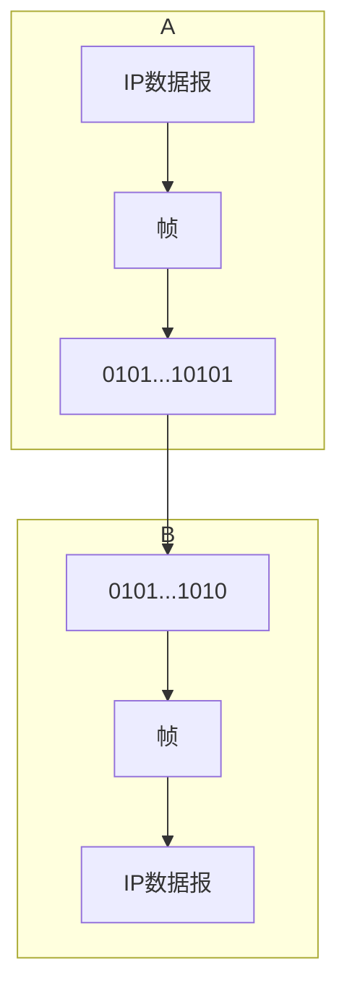

# 点对点的数据链路层

## 封装成帧

- 将[[网络层]]的IP数据报添加头部和尾部封装成**帧**
  > 帧 = 帧首部 + 帧的数据部分 + 帧尾部
- 不同的链路层协议规定了不同帧的数据部分的长度上限
- 最大传送单元MTU值得就是帧数据部分的最大长度

## 透明传输

- 数据链路层协议允许数据部分可以时任意形式的比特组合

## 差错检测

- CRC:循环冗余检验(Cyclic Redundancy Check)
- FCS:帧检验序列(Frame Check Sequence)
  - 由n位二进制组成
  - n通常取16或32
